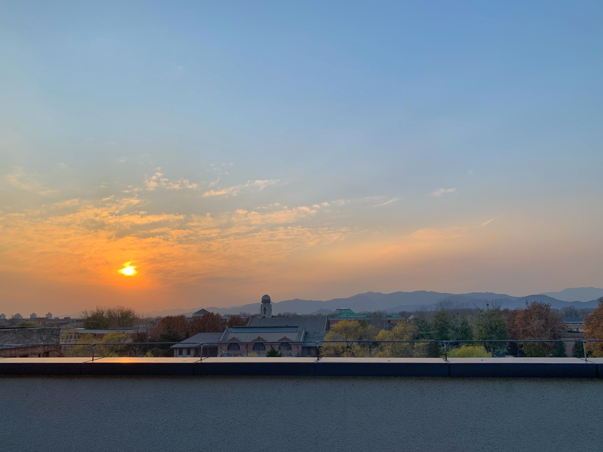
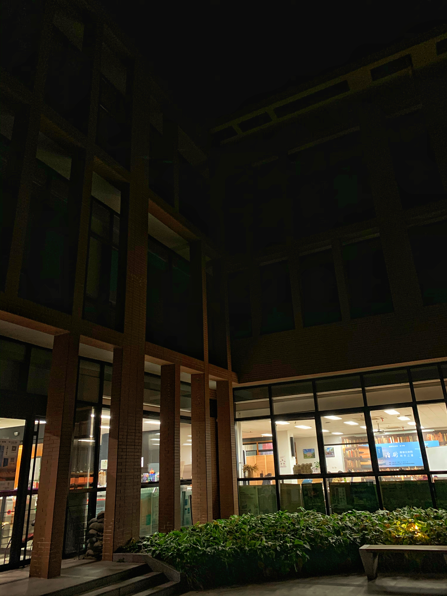
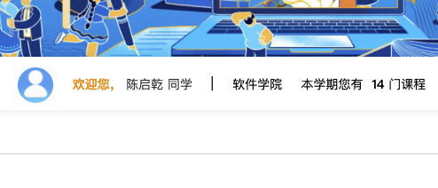
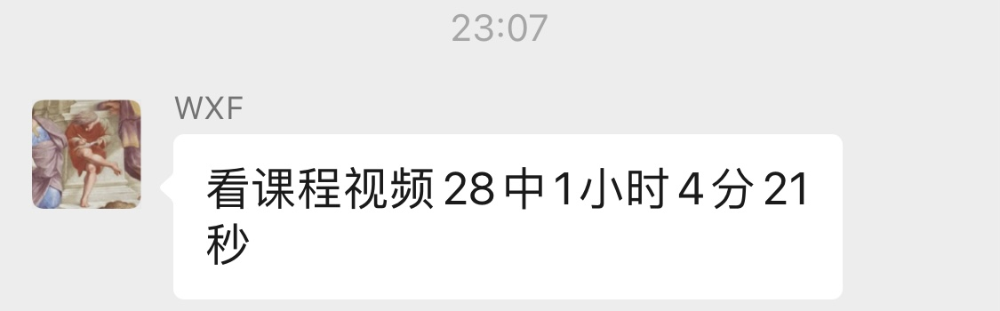
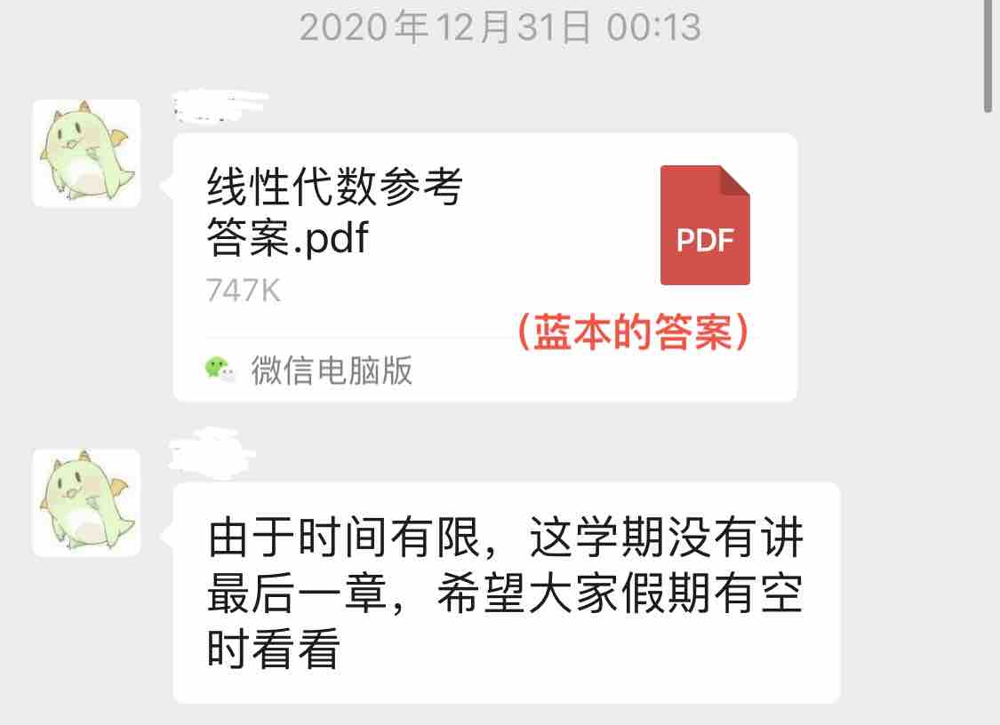
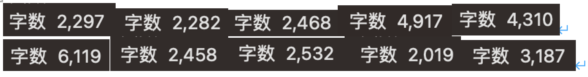
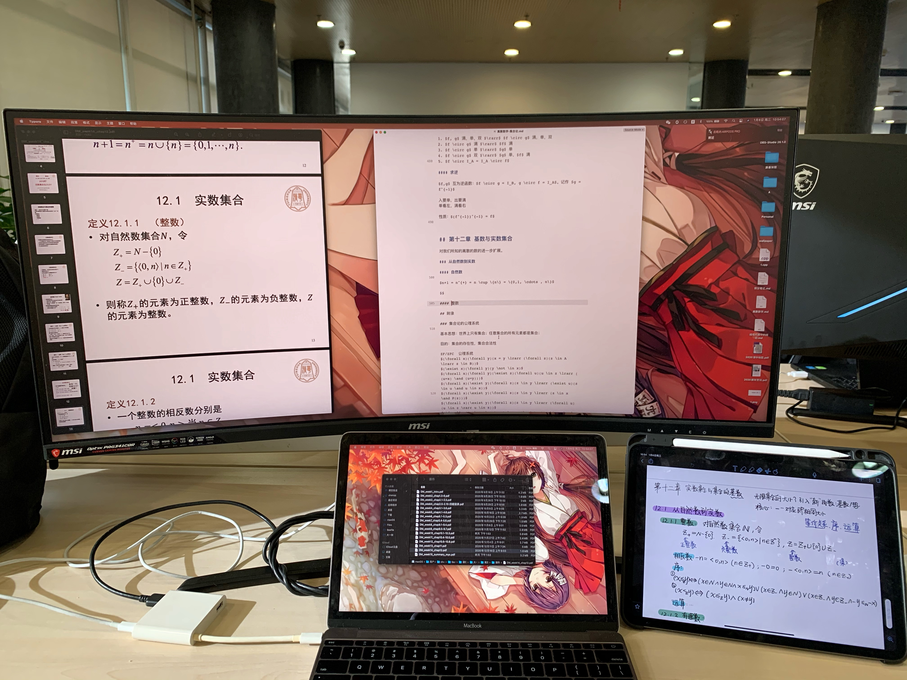
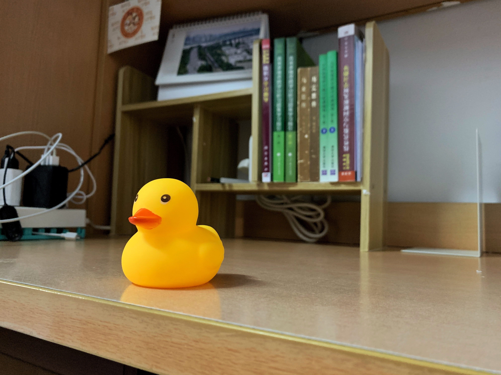

---
##-- draftstate --##
draft: false
##-- page info --##
title: "2020秋季学期总结"
description: ""
date: 2021-01-10T19:00:00+08:00
categories:
- 总结
tags:
series:
- 学期总结
##-- page setting --##
# slug: ""
# type: ""
pinned: false
libraries:
- mathjax 
##-- toc setting --##
hideToc: false
enableToc: false
enableTocContent: false
---

今天回家了，这学期算是彻底结束了。碎碎念地总结一下吧。

 <!--more-->

这个学期在你清，似乎没有什么“上大学”显著的变化感：气候还是一样的气候，地方也熟悉过若干次，身边的人竟都变化不大。说起来，rdfz倒确实是“更像大学的高中”。

这学期大概和清华园成了“朋友”吧。在许多地方看过清华园的日暮（忽然想起来，日出的时候大多还没起床hhh）。

见过午，见过夜。

除了几个教工食堂，基本打卡了校内所有的食堂/楼层，各个图书馆都走过一遍，借书过，自习过。能试的基本都试过了，说来有趣，尝试新鲜的事物甚至可以成为生活最主要的动力。

学习上呢，不那么尽如人意。这个学期本来就选了不少课，又因为各种原因多出来好几门课，所以就...

无论如何，这学期也算是过去了。

说说上的课吧。

这学期，数学课是最重的。微积分w，也不过如此嘛（雾）。wxf讲的确实好，但也确实和考试相关度不那么高；期中之后靠刷高微和偷听yp的课感觉自己（基本）学明白了，但是最后考试还是没什么分（原来换头像是没什么用的）。线性代数老师讲课一板一眼，十分认真负责，而我大概总是介于学明白和没学明白的叠加态（一会特明白，一会啥都不会），好在最后考试不是很难；离散老师很好，但架不住课\*\*，于是在期中过后就进入了上课自学的阶段（并且十分后悔，后悔没有早点这么做），然而还是在最后三天学懂的最多（捂脸），考试...也就那样吧。这学期遇到数学系的老师和助教（尤其是线代~）都很不错，十分感谢有他们。

程序设计基础的话，当小(gong)教(ju)员(ren)【只是因为今年贵类oier少才轮到我这个菜鸡qaq】确实是很有意思的体验。最开始的时候确实有一段时间会遭遇到很多奇怪的问题（或者之后阴间作业出现的时候），不过渐渐大家好像都学会了编程，也就没什么问题了。课没怎么听，认识（也许还勉强算认识罢）的同学却多了不少，也多了一两个“朋友”，算是工具人的一点回报吧。其实给别人解释问题的时候，自己也得去思考/学习很多，比如了解了一点编译/运行的深层原理。当然，我也深刻意识到自己的语言表达能力是多么的见鬼的差，下次一定改…（哦程设还写了大作业，好像没什么好说的…）

下一个印象深刻的课大概是写沟吧。写沟选了城市的话题，算是致敬高中选的地理。课确实很有意思，写作理论学习，辩论，集体写作等等有意思的活动。老师也很好，温婉又具有力量。但写起东西来就不是那么轻松，各种地方查文献，读参考书，学习参考文献格式…这门课大概更适合被称作“学术研究入门”。尤其是长文，开题就给自己挖了一个大坑，之后填的十分痛苦…所以劝还没上这门课的同学，写沟千万不要自己为难自己…不过，上了写沟再写其他两门课的5000字论文，就感觉轻松多了（说起来我觉得其他的两篇论文都写的比写沟长文好orz）

（以上是孩子这学期的写的2000字+的东西orz）

到这里已经17个学分了。说点水课吧。我曾经理想着，大学的每一门课都要认真学…后来：“有这时间，做点别的课的作业吧。”点名一下“水”课：人文社会科学计算导论：老师上课吹水+下课摸鱼；党的知识概论：从“老师”到同学都明白其性质；信息科学技术概论：交三篇论文的讲座课，能指望它有什么深度；军事理论：开始还认真听，后面管的松了之后就在课上看书了。

思修也还有点意思。全周上课，还有小组大pre和1500字期末考试，任务量算是挺大。不过也是开始认真，后面就开始划水…不过也交到了新朋友，感觉这课上的值啊（2333 形势与政策课的老师也很不错，讲的东西也很有意思，只不过这个课时间真的很少，感觉也学不到什么。大作业倒是付出了很多的气力，希望分数不要太低吧…

体育也遇到了一个好老师，课程常规任务结束之后允许我们快乐足球，实在是一周的快乐时光…但是我体育…还是很差…呜呜呜…

想了一圈最后想到英语课，足以说明它的地位了…又是一个熟人很多的课，读了一本很有意思的书，和很棒的队友做了一次不是粗制滥造的pre…但老师讲的课吧，老师布置的作业吧…就透露着一股你摸我也摸的气息（

这学期还经常和某同学交流（事实上是我单向吐槽）贵系（类）的课程设置和教学思想，其实经常是我一个人言辞慷慨。放一些暴论在此供大家批判：“程序设计基础就不应该讲算法，算法应该拆出去单独成课”“离散就是一门\*\*课，明年血书换课本吧”“离散不如让数学系的老师来讲”“信概是什么\*\*课，凭什么还能进必修，不如换成计科基”“我觉得应该设’计算机哲学基础’这门课”…年少轻狂，如斯也（

——————————————————

这学期没有什么社工活动，主要是单线生活。每天宿舍-食堂-教学楼-图书馆的活动范围，然而仍然每天被ddl追着跑。想要做点学习以外的事情，学点哲学和中文，保持阅读，也都时断时续。说起来挺不甘，但可能能力所限，也就只能这样了吧。

这学期多了不少认识的人和一些新朋友，当然也有许多人渐渐或突然的不再联系。不过这挺正常的。越来越觉得，人和人之间的陌生才是常态。一个学期，与许多人还没相识就又成为了陌生人；许多或许相识的人，慢慢也就各自离去。有的人或许在你的微信列表里，有的人甚至从头到尾都不会在，给你留下的只有一段或有或无的记忆。这和一场梦又有什么区别呢？

因此感谢那些曾在我身边，或还在我身边的人的人。

来你清的这几个月也在学习怎么和人打交道，包括别人，包括自己。学着“委婉语气表坚决”的修辞方法，学着如何在网络上和现实上与别人交流，学着如何去“勇敢”的表现自己，学着如何在压力面前善待自己，学着如何接受至一个充满缺陷的自己，学会在没有做好“充足准备”的情况下做许多事情…在思考如何处理自己的情感，如何和别人更好的相处。当然我很多事情做的可能都不合适，希望各位还愿意和我做朋友，或者至少愿意还“认识”我…

当然，回顾这几个月，长进最大的当然是自行车技术，都可以骑着车打清华拳第一节了（

虽然写了很多，难免还是很难说尽这一个学期的得失与经历。宿舍窗外梧桐树上的乌鸦在假期也会每天准时地叫起来罢。但是之后六周，我要听不到它们的声音了。

对寒假和下个学期也有很多的期待。前几天有人问我目标和理想，我回答的是：“希望好好活着，希望能在世俗意义上成功，也希望能拥有‘人’应有的深度和情怀。”下学期大概就是这样的目标吧。