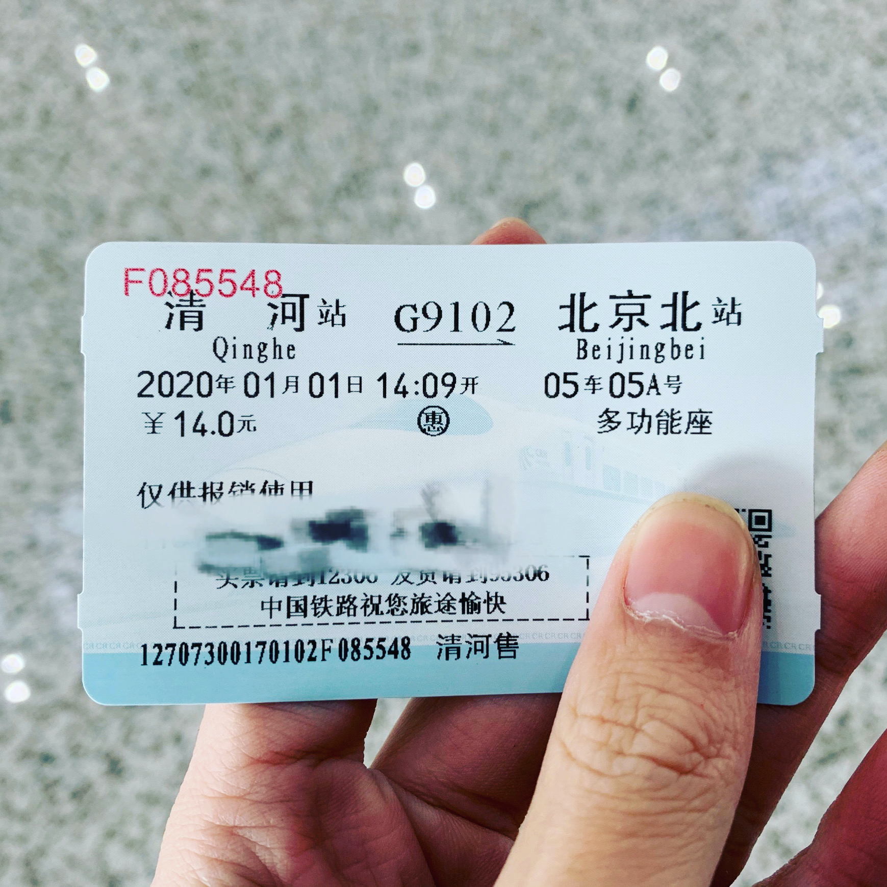

---
##-- draftstate --##
draft: false
##-- page info --##
title: "2020年新年贺词"
description: ""
date: 2020-01-01T00:00:00+08:00
categories:
- 随笔
tags:
- 新年贺词
series:
##-- page setting --##
# slug: ""
# type: ""
pinned: false
libraries:
- mathjax 
##-- toc setting --##
hideToc: false
enableToc: true
enableTocContent: true
---

2019年已经过去。2020年已经到来。
<!--more-->

在2019年，我经历了许多。一月广州的惊鸿一瞥，四月首师附的最后一赛，五月清华园里的一缕回味，两年信息学竞赛的学习，在今年落下了帷幕。八月盛夏，紫荆公寓的七天初体验，是高二最后的终止符，也是高三启程的汽笛。九月、十月、十一月、十二月，高三生活的画卷徐徐铺开，充满字迹的五三，逐渐饱满的卷夹和每月一次的大考共同见证了这半年的辛劳与成长。这一年，许多人还在我们身边，许多人也渐渐离我们远去;这一年，也曾欢喜，也曾颓唐。站在新年的路口上回望，过去一年的回忆已然成了刻满里程的石碑，或有平稳不惊，或有起起伏伏，如今看去，其实都似闲云。回首千帆，不过是一段写满了“成长”的经历罢了。

在2020年，我将面对更多。已然在面前的期末考试是有重大意义的节点;而一模二模高考和九月的大学生活，都是未知的旅程。成人的到来，似乎更标志着人生进入了一个崭新的阶段。从这里开始，人生的道路不再是在有限的分叉中抉择，而是在无穷无尽的可能中寻觅方向。或许路途中会有惊慌，会有迷茫;但请不要忘记你曾吟咏过的诗行:“不管风吹浪打，胜似闲庭信步”。或许路途中也会有欢喜，会有激动;但请不要忘记东坡千年回响的箴言:“只堪妆点浮生梦”。2020年大概只是一个起点，她真正的意义恐怕更在于之后的十年，是真正从“小孩”变成“成人”的十年：脱除稚气，淬炼成金。童年的时光终会离去，从现在开始拥抱那新的社会角色吧——具有完全民事行为能力的成年人。

抬起头来，向远方看吧。大江澎湃地奔腾，伙伴们正在争流。不要停留，不要回望，驾船出发吧;在我们的前方，人生的朝霞正在天边，闪耀着夺目的光辉。