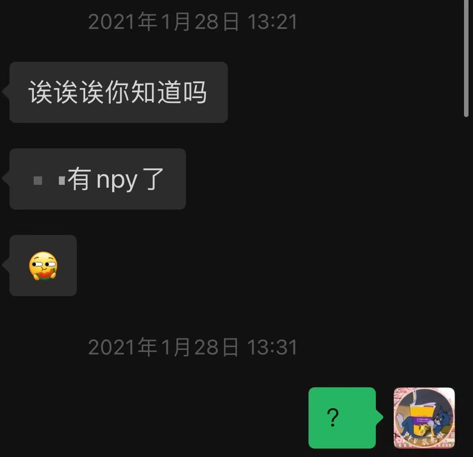
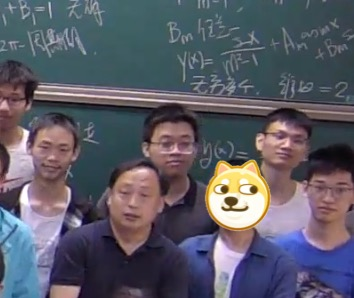
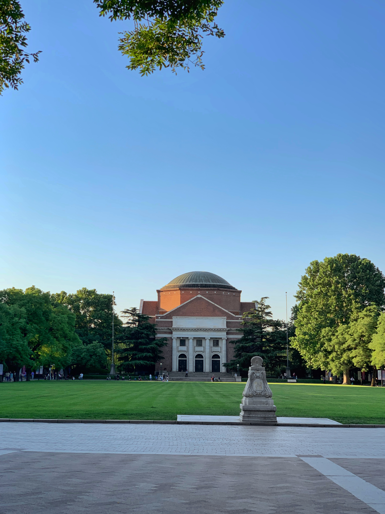
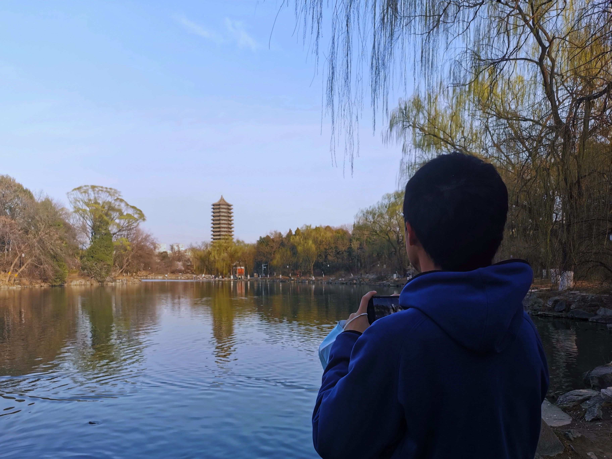

---
##-- draftstate --##
draft: false
##-- page info --##
title: "2021春季学期总结"
date: 2022-01-26T13:55:33+08:00
categories:
- 总结
tags:
series:
- 学期总结
##-- page setting --##
# slug: ""
# type: ""
pinned: false
libraries:
- mathjax 
##-- toc setting --##
hideToc: false
enableToc: false
enableTocContent: false
---

这个学期应该从寒假说起。

<!--more-->

寒假一直待在北京，就做了三件小事：读书、预习、写小程序，时不时也出去玩玩转转，十分惭愧。不过也有一些怪事，比如学着学着微积分突然收到微信：

---

开学。

对于这学期的课程，回想了半天，发现这学期最多的是：老师讲的不错，但我没有（认真）听。

微积分 w，这碗“汤”到底好不好喝？不好说。一年下来，我了解了多少数学的本质，又看到了多少数学的美？不好说。当初选 wxf ，是因为抱有现在都不知道该如何形容的的自信和追求，“无论什么样的数学我都能学会”， “我要学难的数学，学到真东西”。过了一年，看起来未免有些可笑？但现在也不后悔。毕竟为了看风景，总是会绕些远路的嘛…

(不小心蹭到老师旁边的合影[Doge])

大学物理…xs，根本没B站上的视频讲的好。一学期下来完全无感，感觉啥也没学到…

高代嘤，是因为不想上公共英语而凑的一门嘤语课…呃怎么说呢，老师人很好，但由于各种原因，上课的体验实在一般…不过比起其他同学上的高代，在课程设置上似乎的确不那么卷，比较轻松愉快…

离散，数据结构，oop，三门专业课几乎全都没听，要么自学要么不学（啊，现在说起来还是有那么一点惭愧orz）。希望考试没事orz

诚恳建议下一届同学，离散千万一定要（对着ppt）自学，不能听他讲…也不由得感慨，邓公的课真的好，真的真的好。

体育课打清华拳，似乎也没有什么可以说的。开始觉得不太行，后面也就…还可以嘛…事少给分好就行.jpg

史纲，老庄研读。两个文科课，都不留作业，考核也都和听不听课没有什么关系。史纲似乎认真听了上半个学期，老庄大概还算认真听了一个学期。最后几乎都是一篇论文定分数，希望没事.jpg

北大的中史地。最后用了一天半极限复习，结果发现压根没有必要，看看往年题就够了…（希望不被卡优秀率orz）研究往年题的过程真的很像研究历史地理，不仅要研究题目过去的特征、发展，还要来预测、指导当下的题目（

又是二十九个学分，然而就这么点事情。看pyq 某位同学硬课成群，学习体验丰富；再看看我，水课一堆，整日摸鱼，实在惭愧万分。

上完这些课，明显感到一种疏离感，大概是它们并没有进入我，给我的生命留下一些印记（像上学期的写沟之类），而只是浮光掠影地从人生上空掠过…

考试前写离散的A4纸到最后写不下了，写不下的部分偏偏在考试中涉及不少，这似乎是个很有意思的隐喻：当我们学到最后，那些“没有时间”去复习，“没有能力”去掌握的东西，恰是重要的东西…

有时候问自己，为什么学习会成了这种样子？所谓成绩，很大程度上被如下决定：上课之前会不会+复习与考试的契合度…像数学，本最不应抱着为考试而学的功利性仔细咀嚼，然而现在却在几个学期内疯狂赶路，真没意思hhh或许也不是同学的不好，当在群里看到“请问xxx知识点考查嘛”这种话，而并非试图去搞明白xxx知识点…

下学期估计还是会选不少课，大概会搬一两门课，学辅修，选一些奇怪课整活）

感觉这个学期对大学学习稍微开了一点窍。行胜于言，下学期加油。

---

除了学习，这学期其实更想要做一个活生生的人，似乎也差不多做成了hh

开学初身体一波不好，做完肠镜在清青快餐的椅子上肠痉挛的时候，第一次感慨人间如此真实…现在彻底好了，期末周又开始作自己的身体了….要是身体状态不好，根本就扛不过去期末周hhh

也是开学初，比较闲的时候读了若干本书，现在看起来还是显得很值得的，到后面就没有时间看自己想看的书了…寒假开始就试图记录一点日常生活，也显著时断时续…

这学期试着加入社团，但一个就没活动，一个活动时间完美被莫名其妙延长了1h的oop撞飞…试着加入院里的学生会，做一些微小的工作，但似乎也摆脱不了摸鱼划水的作风。班委似乎也没有做什么事情。

下学期一定.jpg

现在在组暑期实践，希望别摸下去了（

这学期似乎更体会到孤独一些。有大学刚有一点熟悉的同学要分流走，有高中的同学许多在专业上也要渐行渐远，更不必说更之前的朋友了。怎么获取一些朋友，融入一些/创造一些圈子呢…？不太明白。

在试图给自己接上一些新的人格，模仿某些周围的人的生活方式…一旦认真的审查过去的自己，会发现变得很快，很大。是好事吗？不知道。

翻到刚开学给清华写的“情书”，真切地发现这一年变化有多大。那些曾经重视的东西现在也不太看重，那些曾经自以为是的顺利现在都被打碎。生活上似乎没有一个头绪，但生活又的的确确在往下进行…不太懂。

---

一周去北大上两课时的课，似乎不应会对我的生活产生很大的影响。

一个学期下来如今再回看，应该少说些自作多情的所谓“反思”，也少说些自己不知真伪的“精北”，要说的只剩下：未名湖风景真好看）

无处安放的表达欲和表现欲驱使着我，说了这么多啰啰嗦嗦的乱七八糟的事情...