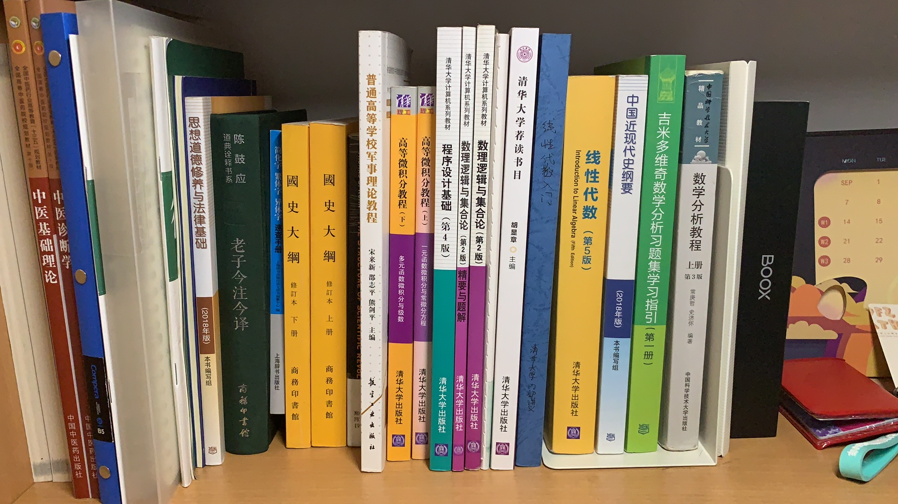
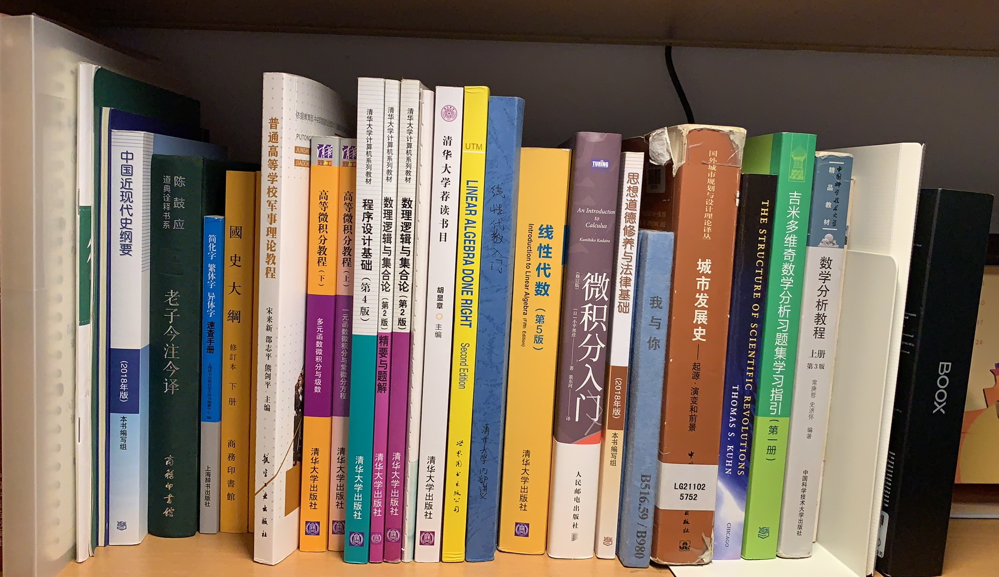
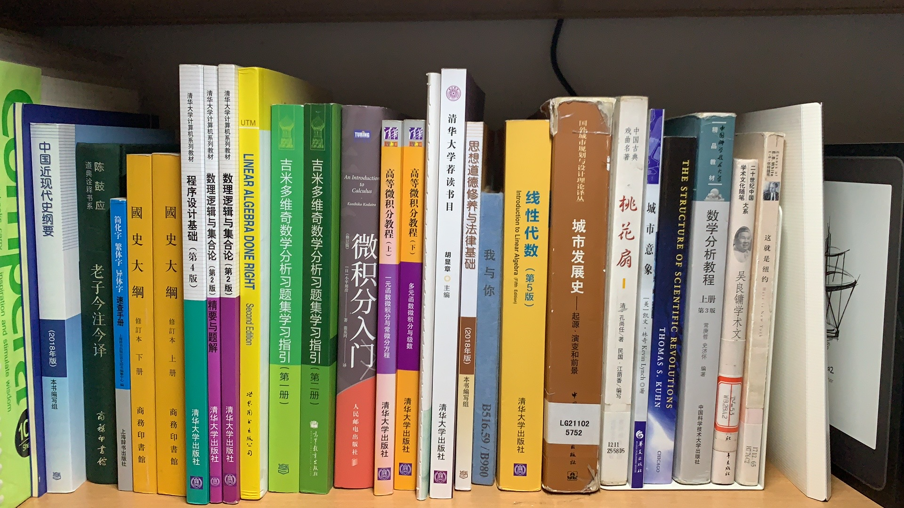

---
##-- draftstate --##
draft: false
##-- page info --##
title: "First Days in THU"
date: 2020-10-19T19:52:53+08:00
categories:
- 随笔
tags:
series:
##-- page setting --##
# slug: ""
# type: ""
pinned: false
libraries:
- mathjax 
##-- toc setting --##
hideToc: false
enableToc: true
enableTocContent: true
---

其实现在已经开学一个多月了，但其实在 THU 的生活也才刚刚开始。写些东西来记录最初的生活，还是很有必要的。

<!--more-->

> 想来也有趣，在 THU 的生活总共也就 50 个月，现在已经过去了 1/50 ；人生总共 1000 个月，现在又过去了 1/1000 。
>
> 但是现在并没有他们即将过去的感觉。

写小说要先介绍时间地点人物，写记录大概也要先介绍环境。

## 校园

清华很大，也很小。最北边是学生公寓。

### 学生公寓

学生公寓大概分为紫荆区和南区。我们住在紫荆一号楼。

cqq翻遍了自己的手机，发现一张宿舍外景的照片都没有拍过，虽然每天都有很长的时间在宿舍度过，但宿舍却是最不留意的地方。

从楼号就可以看出，紫荆一号楼大概是紫荆公寓里最老资历的楼了。楼外看上去与其他的楼也没什么区别，楼内的装修处在微妙的界限上，与现在的时代藕断丝连。楼内主要住的是无系，雷系和软院的同学，旁边就是无系的新生和学长

> “要像坟墓一样简洁。”

然而，这在宿舍宿舍并做不到。上床下桌的布置给每个人一个相对独立的空间，私密性和自由度相对来说算是很不错。

目前的一个月，还可以保持桌面整洁到可以展开一张人民日报，然而看到学长的寝室的整洁程度，真不知道自己一年过后又会怎么样...

说到桌子，就想起来在上大学前，赶着暑假看了不少书（至少比这一个月来看），哲学、逻辑学、经济学、政治学、道德经、中医、数学......在开学之前天真的以为自己能有时间看书，于是就买/带了不少书来到学校，开学第一周甚至还从图书馆里借了闲书，现在才发现根本没有这个时间23333

于是就有了...书架的进击.gif

现在也发现，很多书也只值得泛读，也还有很多书值得记笔记精读。要把握好度，否则啥书都读不完了.jpeg

【动态更新.jpg】

【要是cqq忘记/懒得更新了记得催他！！】