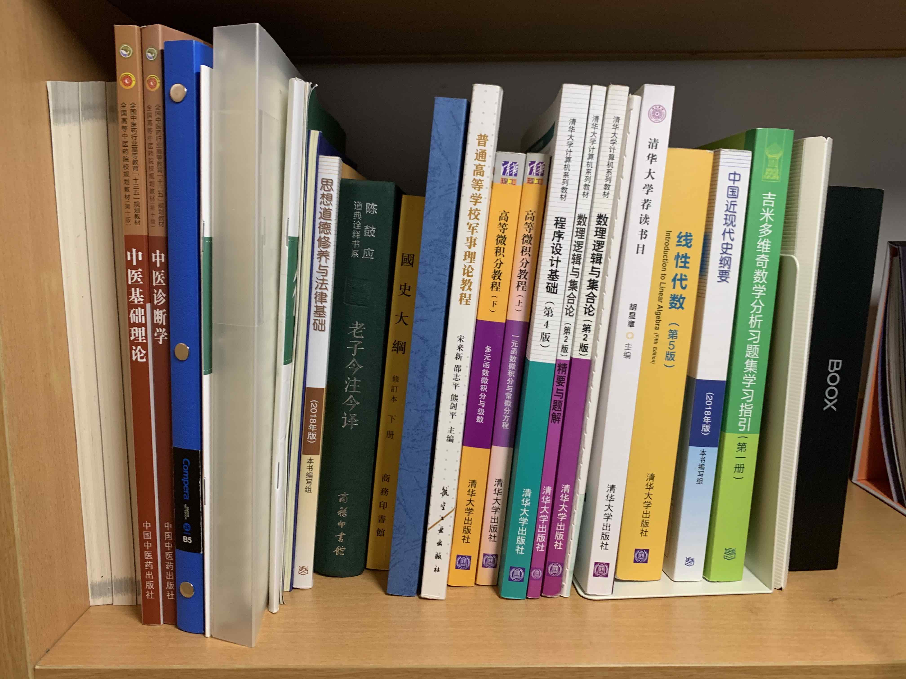
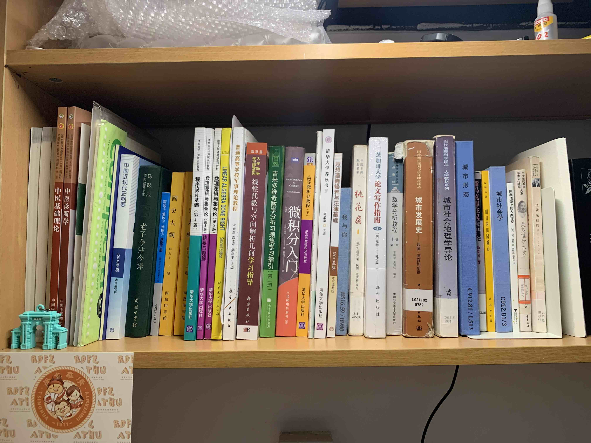
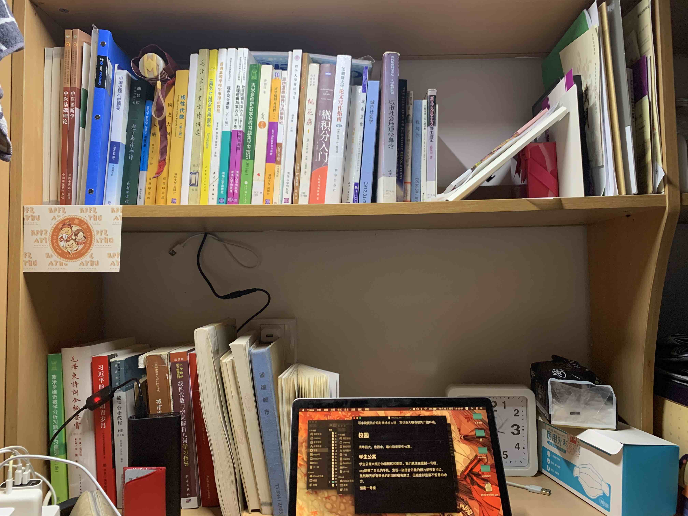
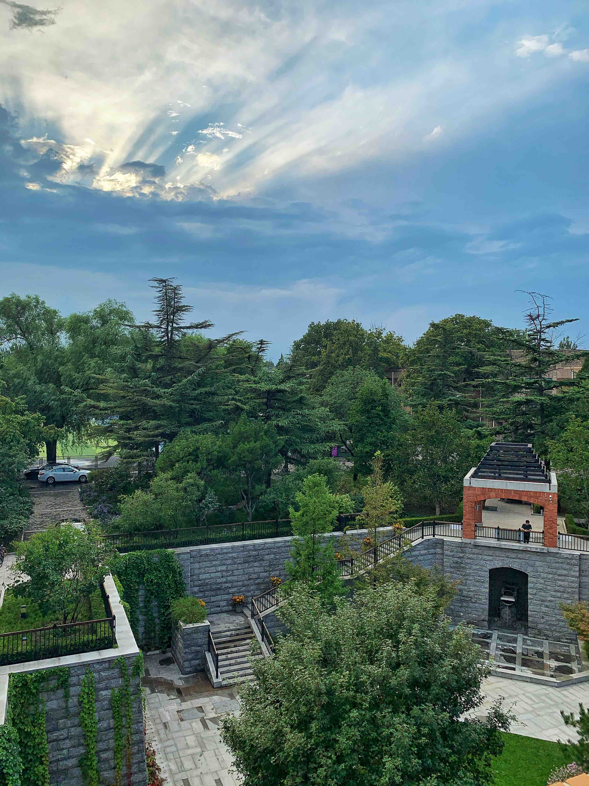
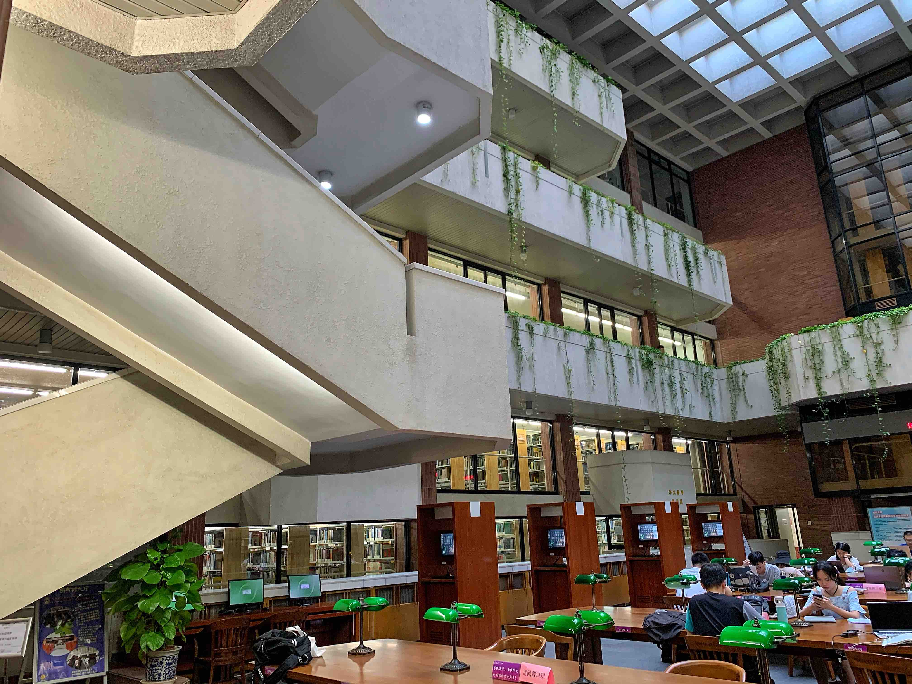
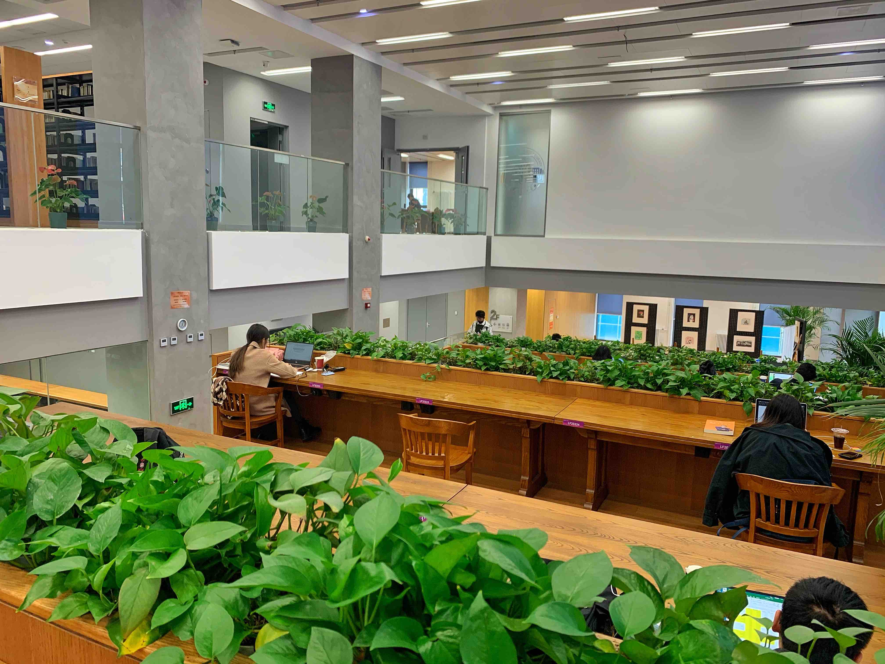
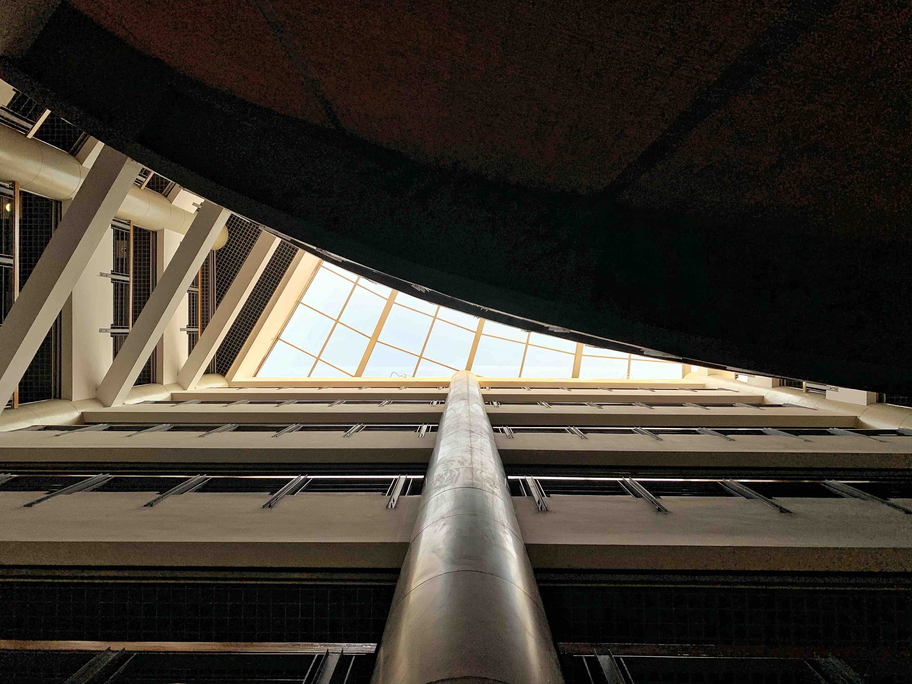
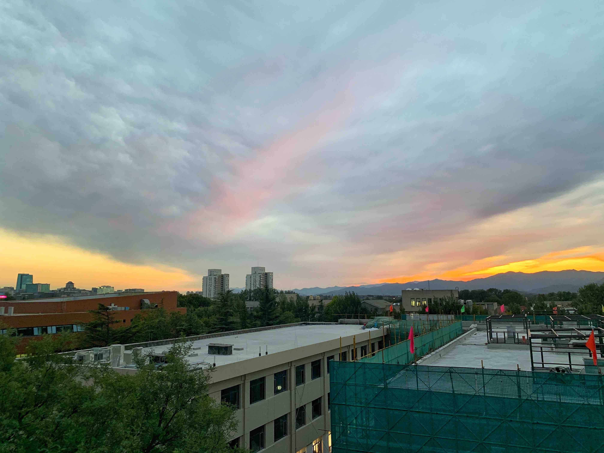

---
##-- draftstate --##
draft: false
##-- page info --##
title: "First Days in THU"
date: 2020-10-19T19:52:53+08:00
categories:
- 随笔
tags:
series:
##-- page setting --##
# slug: ""
# type: ""
pinned: false
libraries:
- mathjax 
##-- toc setting --##
hideToc: false
enableToc: true
enableTocContent: true
---

【最新更新：20201026】

其实现在已经开学一个多月了，但其实在 THU 的生活也才刚刚开始。写些东西来记录最初的生活，还是很有必要的。

<!--more-->

以前也曾想写过这种长篇，但是其实坚持不下来的概率很大，因为自己也不知道到底会写多长。

> 想来也有趣，在 THU 的生活总共也就 50 个月，现在已经过去了 1/50 ；人生总共 1000 个月，现在又过去了 1/1000 。
>
> 但是现在并没有他们即将过去的感觉。

写小说要先介绍时间地点人物，写记录大概也要先介绍环境。

## 校园

清华很大，也很小。最北边是学生公寓。

### 学生公寓

学生公寓大概分为紫荆区和南区。我们住在紫荆一号楼。

cqq翻遍了自己的手机，发现一张宿舍外景的照片都没有拍过，虽然每天都有很长的时间在宿舍度过，但宿舍却是最不留意的地方。

从楼号就可以看出，紫荆一号楼大概是紫荆公寓里最老资历的楼了。楼外看上去与其他的楼也没什么区别，楼内的装修处在微妙的界限上，与现在的时代藕断丝连。楼内主要住的是无系，雷系和软院的同学，旁边就是无系的新生和学长。（如果我没搞错的话..？）

由于疫情原因，现在整栋6层快一千人的宿舍楼只开了一个门，我所在的宿舍在三层，距离楼门的距离也不算远；但问到贵系某人的宿舍就在1层靠近楼门之后...综上所述，没有比较，就没有内卷。宿舍门口就是卫生间，与洗漱间隔楼梯间相望。本来觉得这并不是很好，但现在觉得其实也还可以，毕竟在宿舍的时间也没多少。

> “要像坟墓一样简洁。”

然而，这在宿舍并做不到。上床下桌的布置给每个人一个相对独立的空间，私密性和自由度相对来说算是很不错。

目前的一个月，还可以保持桌面整洁到可以展开一张人民日报，然而看到学长的寝室的整洁程度，真不知道自己一年过后又会怎么样...

说到桌子，就想起来在上大学前，赶着暑假看了不少书（至少比这一个月来看），哲学、逻辑学、经济学、政治学、道德经、中医、数学......在开学之前天真的以为自己能有时间看书，于是就买/带了不少书来到学校，开学第一周甚至还从图书馆里借了闲书，现在才发现根本没有这个时间23333

于是就有了...书架的进击.gif

| 0909            | 0919            | 1020            |
| --------------- | --------------- | --------------- |
|  |  |  |

我真的是计算机类的学生的吗.jpg

现在也发现，很多书也只值得泛读，也还有很多书值得记笔记精读。要把握好度，否则啥书都读不完了.jpeg

说到书，就要说说你清的图书馆了。

### 图书馆

忘了在哪节课上听到的故事：

> 某外国大学的代表团参观校园之后，对某世一大的陪同人员说：“你们想要管理好这所学校太简单了，只要每天按时打开图书馆的大门就可以了。”

确实。清华的图书馆很多，也很大。老馆、西馆、北馆构成的主馆有两个标准田径场那么大，而美术馆、金融馆、建筑馆、法律馆、文科馆等等分馆散布于学校（远离紫荆公寓区）的各个角落，各有特色。

图书馆真香。

|  |  |  |
| ------------- | ------------- | ------------- |
| 北馆          | 西馆          | 法律馆        |

首先是资源。曾经在高大的书架之间漫步，几乎每个书架都会有那么一两本特别引人注目的书，要么是形制夺目，要么是书名奇特。据说，清华图书馆现在有几百万纸质册书，基本所有因为课程或者其他原因需要的书都可以在图书馆书目里面找到，只是不一定还在架上。之所以上一句话说纸质藏书，是因为图书馆还有很多很多电子资源，包括各种书、教参的电子版，还有各种文献网站的知网，挺不错。

其次是环境。你清环境本来就不错，图书馆更是“颜值担当”。北馆的下沉广场和邺架轩，西馆的爬山虎，法律馆的绿萝，绿色的活力和棕色的木桌搭配，很有意境。图书馆相比宿舍最好的，就是高层高和开放的空间；高层高营造了不压抑的氛围，开放式的空间让自己不至于学到自闭。虽然宿舍也是人人都在学习，但毕竟在不认识的人面前，那种竞争的沉重也可以放下些。

从图书馆借了不少书，目前（10.22）还没还回去几本，有几本书大概快需要续借了，有几本书自从借回来就没怎么翻过。很惭愧，一定要保证借过的书都看过！大学如果不读书哪里还是大学生活呢...

在你清，图书馆的本质其实是大型插座充足自习室。事实上也的确是的，平均下来我一天大概也能有两三个小时在图书馆，主要就是做作业和预习吧。当然，自习也不是只能在宿舍和图书馆。

### 教学楼

教学楼虽然主要用来上课，自然也是自习的好地方。

> 所谓大学者，非有大楼之谓也，有大师之谓也。
>
> ——梅贻琦

梅老校长的话对，但拥有世界一流大楼也是成为世界一流大学的必要条件。

清华的公共教学楼有六座：第一至第五教室楼，第六教学楼。现在，二教和三教正在翻新/维修，我还没有机会使用。四教都是小教室，大一的大课很少有机会用到；一教有几个200人+的教室，可以开思修等全校大课；五教几乎全是180人左右的教室，所以我的许多数学课都放在这里。而六教，既有200人左右的大教室，也有80人的中等教室，还有40人及以下的小教室，教室数量多、类型齐，所以自然就成为我最常活动的地方。线代、写沟、军理、党课，不少课都是在这里上的。

当然，某些系的系馆和一些其他的建筑也会当做教学楼来用，比如技科楼、明理楼，因为有大教室而成为某些大课的上课地点；而古色古香的清华学堂却不知道为什么成为了我们某节晚课的地点。

我最喜欢六教。我一年前来到清华，早已说过了。六教给人一种磅礴而精巧的感受：规模宏大，B区最高有9层，6C300的教室有250人+的规模；设计巧妙，C座不同的层高设计给了阶梯教室以更大的自由度，A区三间相邻的阶梯教室，采光却自然而充足，AB座从一层到顶的空间，有助于辨别空间方位，也能够减少层高的压抑。

有一说一，很多学校只要有这么一栋教学楼，整个学校的教学需求基本上都可以满足了。

但清华还有一二三四五教。

我永远喜欢六教！（至少在三教修好之前！）

| 六教A区的仰望 | 六教C区的远望 |
| ------------- | ------------- |
|    |    |

你清的教学楼，装备齐全。除了基本的设施，有咖啡机，有打印机，有自动售货机，还有装满了人民日报和光明日报的架子！要说不满意的，椅子确实不太舒服，当然也可能是我的腰不太行吧。

在教学楼上完半天的课，接下来除了去图书馆和回宿舍，一般就是去食堂吃饭了。

【上次更新20201026】

【动态更新.jpg】

【要是cqq忘记/懒得更新了记得催他！！】

