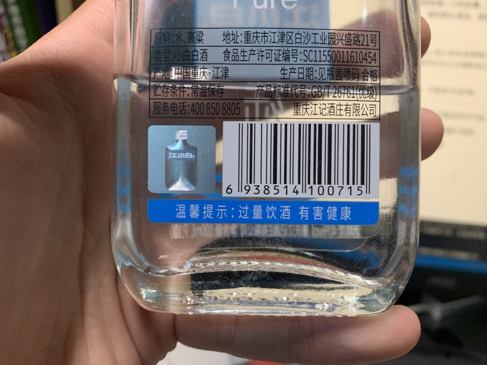

---
##-- draftstate --##
draft: false
##-- page info --##
title: "「随笔」五月二十五日"
date: 2021-05-25T22:01:56+08:00
categories:
- 随笔
tags:
- 随笔
series:
##-- page setting --##
# slug: ""
# type: ""
pinned: false
libraries:
- mathjax 
##-- toc setting --##
hideToc: false
enableToc: true
enableTocContent: true

---

哈哈。
<!--more-->

> 匆匆过了二十多年，我自然也是常常哭，常常笑，别人的啼笑也看过无数回了。
>
> 可是我生平不怕看见泪，自己的热泪也好，别人的呜咽也好；对于几种笑我却会惊心动魄，吓得连呼吸都不敢出声，这些怪异的笑声，有时还是我亲口发出的。
>
> 当一位极亲密的朋友忽然说出一句冷酷无情冰一般的冷话来，而且他自己还不知道他说得会使人心寒，这时候，我们只能哈哈哈莫名其妙地笑了。因为若使不笑，叫我们怎么样好呢？我们这个强笑或者是出于看到他真正的性格（他这句冷语所显露的）和我们先前所认为的他的性格的矛盾，或者我们要勉强这么一笑来表示我们是不会给他的话所震动，我们自己另有一个超乎一切的生活，他的话不能损坏我们于毫发的，或者......。但是那时节我们只觉得不好不这么大笑一声，所以才笑，实在也没有闲暇去仔细分析自己了。
>
> 当我们心里有说不出的苦痛缠着，正要向人细诉，那时我们平时尊敬的人却用个极无聊的理由（甚至于最卑鄙的）来解释我们这穿过心灵的悲哀。看到这深深一层的隔膜，我们除开无聊赖的破涕为笑，还有什么别的办法吗？
>
> 有时候我们倒霉起来，整天从早到晚做的事没有一件不是失败的。到晚上疲累非常，懊恼万分，悔也不是，哭也不是，也只好咽下眼泪，空心地笑着。我们一生忙碌，把不可再得的光阴消磨在马蹄铁轮，以及无谓敷衍之间，整天打算，可是自己不晓得为甚这么费心机，为了要活着用尽苦心来延长这寿命，却又不觉得或者到底有何好处，自己并没有享受生活过，总之黑漆一团活着。夜阑人静，回头一想，哪能够不吃吃地笑，笑时感到无限的生的悲哀。
>
> 就说我们淡于生死了，对于现世界的厌烦同人事的憎恶还会像毒蛇般蜿蜒走到面前，缠着身上。我们真可说倦于一切，可惜我们也没有爱恋上死神，觉得也不值得花那么大劲去求死，在此不生不死心境里，只见伤感重重来袭，偶然挣些力气，来叹几口气，叹完气也免不了失笑，那笑是多么酸苦的。这几种笑声发自我们的口里，自己听到，心中生个不可言喻的恐怖，或者又引起另一个鬼似的狞笑。若使是由他人口里传出，只要我们探讨出他们的源泉，我们也会惺惺惜猩猩而心酸，同时害怕地全身打战。
>
> 此外失望人的傻笑，下头人挨了骂对于主子的陪笑，趾高气扬的热官对于贫贱故交的冷笑，老处女在她们结婚席上所呈的干笑，生离永别时节的苦笑——这些笑全是“自然”跟我们为难，把我们弄得没有办法，我们承认失败了的表现是我们心灵的堡垒下面刺目的降幡。
>
> 莎士比亚的妙句“对着悲哀的微笑”（smiling at grief）说尽此中的苦况。拜伦在他的杰作Don Juan《唐璜》里有二句：
>
> > “Of all tales 'tis the saddest——and more sad. Because it makes us smile.”
> > （在所有故事中它是最可悲——而且还要可悲，因为它让我们微笑。）
>
> 这两句是我愁闷无聊时所喜欢反复吟诵的，因为真能传出“笑”的悲剧情调。

---

虽然我现在面前有 tons of work，但我仍要在这里书写，因为我感到我不能不写。

当你感受到你身边的那个人，那个你认为和你走的是一路的人，他其实和你在很早就已经分叉。对那些，你要说任何都会觉得“——又有什么用呢”，把到嘴边的话咽下，或许还会立下誓再也不提。

---

但，偏偏你还有求于他，他却连**你认为**的顺手之忙都不肯给予。

偏偏你还以为你们的交情足够让他无条件相信你，他却不肯向你移动、移动哪怕一步。

偏偏**你以为**无关紧要的事情，他却珍视似瑰宝、灵魂。

此刻，你怎能不在那巨大到充满你所有生活的迷墙前停下？

无论你尽多少努力，无论你付出多少心意，你觉得你主观上已经不能做得更多，但是你永远无法接近他，你从他那里收获的是沉默，收获的是比沉默更无声的微笑...这是一个看不到底的洞口，他给你的无力感、不安全感，而你偏偏也不能轻易离开他...

---

你说**你以为**...但他摧毁了所有“**你以为**”，以无可辩驳的，以无可反抗的方式。你想，即使他直接把我推下洞口呢...告诉我这一切啊，我不想猜，我也没有猜的能力...我怎么还敢相信心中对于你的任何印象呢？我认识你吗？

---

你看着那个你身边的人，你那么熟悉他，你日日和他相处，但此刻你突然觉得他那么陌生，你心中对他所有的预设都悄然崩塌。

你认识他吗？你觉得你一定认识。你认识他吗？你又觉得不。你看着他，真实在你面前的他，但你只能看到他的皮囊，那个你可能熟悉到每一寸的皮囊。他所有皮囊以下的东西，所有那些你真正“认识”他的东西，似乎都重新隐藏到了厚厚的迷雾下，离你那么遥远，是那么的虚幻，不可触摸。可那是你曾经用几年时间才慢慢擦掉（——至少你这么以为）的啊。

---

每每在这种时刻，一些人和人的关系更能让你不禁生出感慨与赞叹。亲情、爱情，他们之所以被称为崇高，就是人无条件地相信另一个人。父母可以为儿女牺牲自己，爱人会为彼此燃烧自我，这不需要什么理由，唯一的理由就是他们本身。

当然，他们的轰然崩塌，也更加“壮观”啊。

---

今天的我或许懂了当时的你，在这里说声对不起。

你或许马上就能看到，或许永远都看不到吧。

> “温馨提示：过量饮酒 有害健康”

