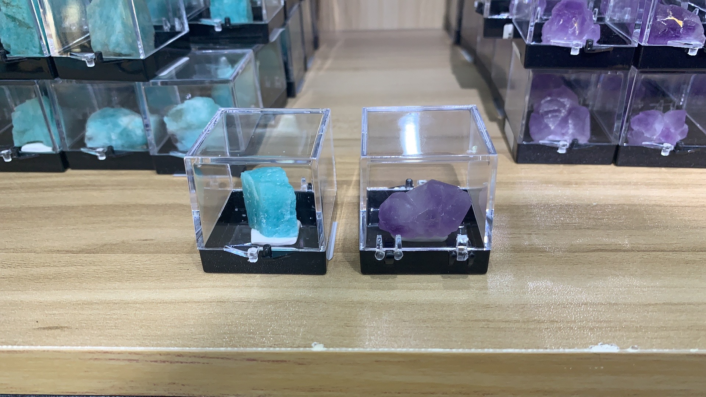
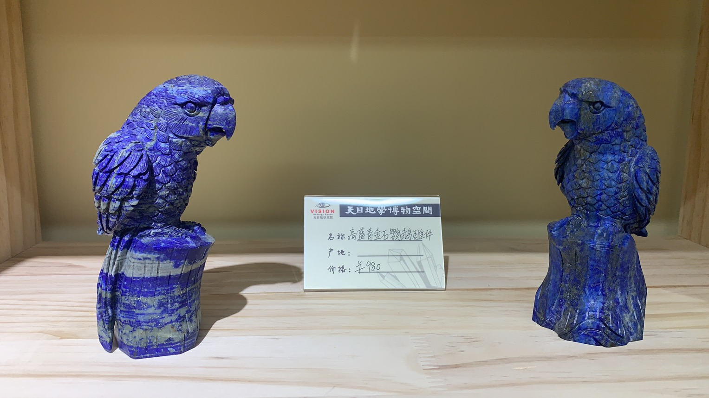

---
##-- draftstate --##
draft: false
##-- page info --##
title: "石头记"
date: 2021-05-03T01:22:46+08:00
categories:
- 随笔
tags:
- 随笔
series:
##-- page setting --##
# slug: ""
# type: ""
pinned: false
libraries:
- mathjax 
##-- toc setting --##
hideToc: false
enableToc: true
enableTocContent: true
---

The Story of Stones.

<!--more-->

左边那块叫天河石，右边那块叫紫水晶。

它们的样子实在太普通了，形状不奇特，材质不透亮，也没有诱人的光彩，在石堆中丝毫不引人注目。它们的价格都不到一顿午饭，有太多比它们珍贵的石头了。

但是，没有两块石头是完全一样的，即使他们看着那么相似，况且更多情况下它们看起来都那么不同。每一块石头，都内蕴着四十六亿年的过往。

因此，它们珍贵吗？它们再普通不过。它们普通吗？它们都独一无二。

---

有那么多形形色色的石头摆在这里，唯独它们在这里相遇、并列了，这有原因吗？或许可以找出一百个原因，它们的绝对、相对位置如何如何，它们的形状、光泽如何如何，它们的纹理、杂质如何，等等、等等。

是，但也不是；因为我挑的时候，只是左边一块，右边一块。

然而，它们的确被挑出来了，这是无可辩驳的事实。它们的生活从此完全改变了。它们从高原下到平原，从展示柜到书架。

然而，现在它们的确相遇了，它们的确并列了，这是无可辩驳的事实。但是，它们对于彼此的特殊有什么理由吗？没有，如果每个人都不同，这些不同并没有什么不同。它们对于彼此一定是最适合的吗？不是，因为我只看了摆在最上面的几个。

它们的确被挑进购物袋中，它们的确相遇在展示柜案头，它们的确并列在书桌架上，这是无可辩驳的事实。有的时候，必须停止（至少是暂时地）那些问句：“为什么？”，因为这无可辩驳，它就是这个样子。

所以呢？我问我的内心。

我不知道。

接受[^1]，并试图去享受[^2]吧。

---

P.S. 迷惑发言：

> “存在先于本质。”
>
> "Existence precedes essence."

[^1]: 这只代表接受过去的世界，并不代表接受这个过去的世界于未来中仍存续。
[^2]:  与世界中的不幸抗争，大概也是一种享受。

