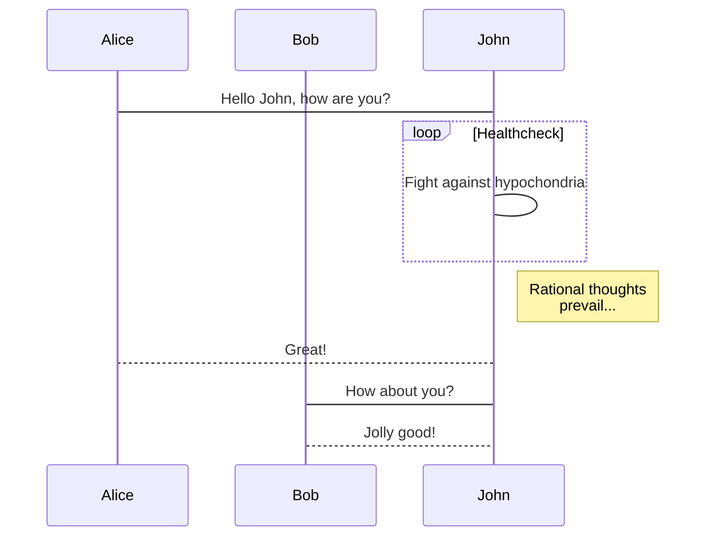
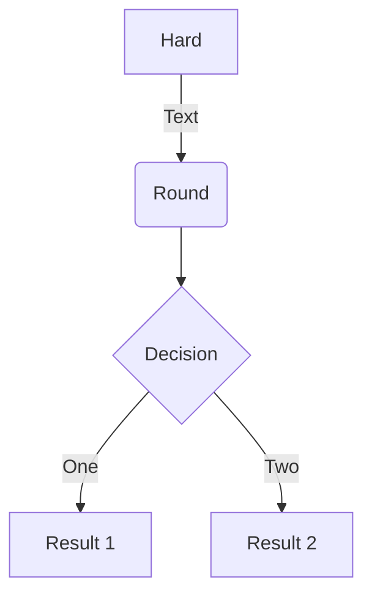
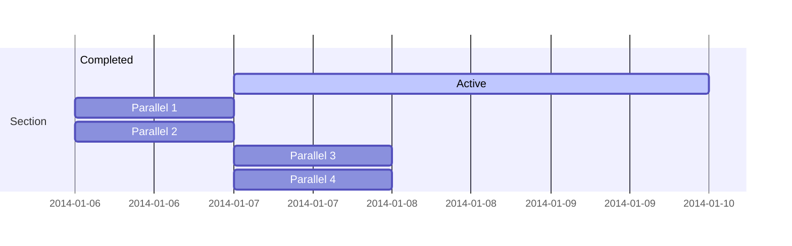
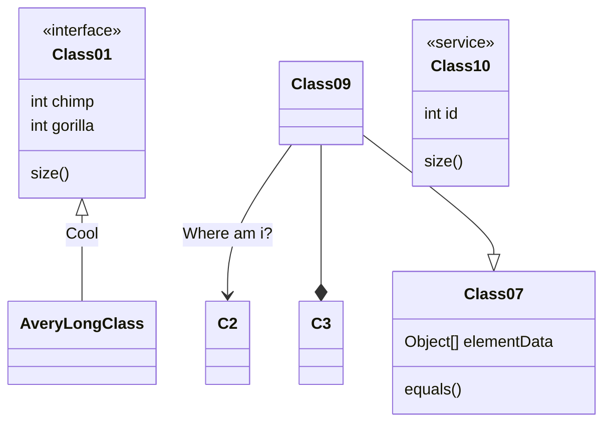
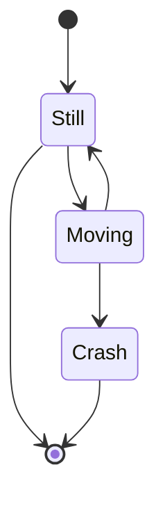
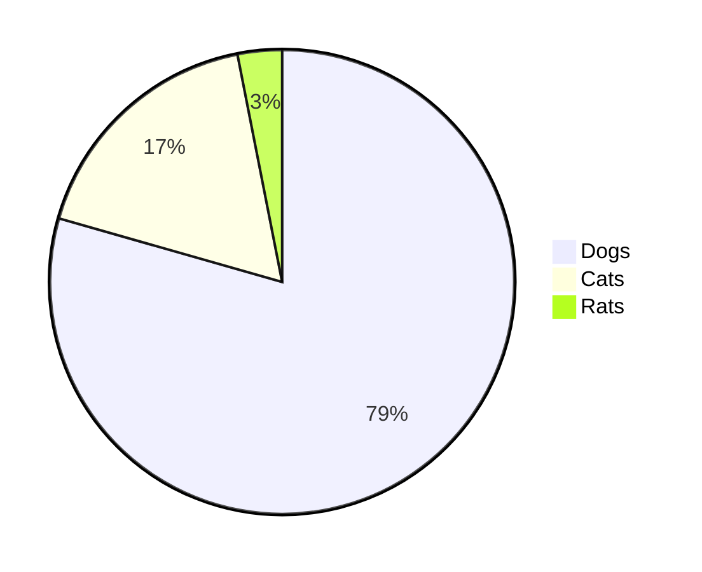

## Emoji Support

Emoji can be enabled in a Hugo project in a number of ways. 
<!--more-->
The [`emojify`](https://gohugo.io/functions/emojify/) function can be called directly in templates or [Inline Shortcodes](https://gohugo.io/templates/shortcode-templates/#inline-shortcodes). 

To enable emoji globally, set `enableEmoji` to `true` in your site’s [configuration](https://gohugo.io/getting-started/configuration/) and then you can type emoji shorthand codes directly in content files; e.g.


<p><span class="nowrap"><span class="emojify">🙈</span> <code>:see_no_evil:</code></span>  <span class="nowrap"><span class="emojify">🙉</span> <code>:hear_no_evil:</code></span>  <span class="nowrap"><span class="emojify">🙊</span> <code>:speak_no_evil:</code></span></p>
<br>

The [Emoji cheat sheet](http://www.emoji-cheat-sheet.com/) is a useful reference for emoji shorthand codes.

***

**N.B.** The above steps enable Unicode Standard emoji characters and sequences in Hugo, however the rendering of these glyphs depends on the browser and the platform. To style the emoji you can either use a third party emoji font or a font stack; e.g.


.emoji {
font-family: Apple Color Emoji,Segoe UI Emoji,NotoColorEmoji,Segoe UI Symbol,Android Emoji,EmojiSymbols;
}



<style>
.emojify {
	font-family: Apple Color Emoji,Segoe UI Emoji,NotoColorEmoji,Segoe UI Symbol,Android Emoji,EmojiSymbols;
	font-size: 2rem;
	vertical-align: middle;
}
@media screen and (max-width:650px) {
    .nowrap {
	display: block;
	margin: 25px 0;
}
}
</style>


## Rich Content

Hugo ships with several [Built-in Shortcodes](https://gohugo.io/content-management/shortcodes/#use-hugo-s-built-in-shortcodes) for rich content, along with a [Privacy Config](https://gohugo.io/about/hugo-and-gdpr/) and a set of Simple Shortcodes that enable static and no-JS versions of various social media embeds.
<!--more-->
---


## Math Typesetting


We need goldmark katex entension which is not yet we have: 
[https://github.com/gohugoio/hugo/issues/6544](https://github.com/gohugoio/hugo/issues/6544)


Mathematical notation in a Hugo project can be enabled by using third party JavaScript libraries.
<!--more-->

In this example we will be using [KaTeX](https://katex.org/)

- Create a partial under `/layouts/partials/math.html`
- Within this partial reference the [Auto-render Extension](https://katex.org/docs/autorender.html) or host these scripts locally.
- Include the partial in your templates like so:  

```
{{ if or .Params.math .Site.Params.math }}
{{ partial "math.html" . }}
{{ end }}
```
- To enable KaTex globally set the parameter `math` to `true` in a project's configuration
- To enable KaTex on a per page basis include the parameter `math: true` in content files.

**Note:** Use the online reference of [Supported TeX Functions](https://katex.org/docs/supported.html)

### Examples

Inline math: $$ \varphi = \dfrac{1+\sqrt5}{2}= 1.6180339887… $$

Block math:

$$
 \varphi = 1+\frac{1} {1+\frac{1} {1+\frac{1} {1+\cdots} } } 
$$

## Code Syntax Highlighting

Verify the following code blocks render as code blocks and highlight properly. 

More about tuning syntax highlighting is the [Hugo documentation](https://gohugo.io/content-management/syntax-highlighting/).

### Diff

``` diff {hl_lines=[4,"6-7"]}
*** /path/to/original	''timestamp''
--- /path/to/new	''timestamp''
***************
*** 1 ****
! This is a line.
--- 1 ---
! This is a replacement line.
It is important to spell
-removed line
+new line
```

```diff {hl_lines=[4,"6-7"], linenos=false}
*** /path/to/original	''timestamp''
--- /path/to/new	''timestamp''
***************
*** 1 ****
! This is a line.
--- 1 ---
! This is a replacement line.
It is important to spell
-removed line
+new line
```

### Makefile

``` makefile {linenos=false}
CC=gcc
CFLAGS=-I.

hellomake: hellomake.o hellofunc.o
     $(CC) -o hellomake hellomake.o hellofunc.o -I.
```

``` makefile
CC=gcc
CFLAGS=-I.

hellomake: hellomake.o hellofunc.o
     $(CC) -o hellomake hellomake.o hellofunc.o -I.
```

### JSON

``` json
{"employees":[
    {"firstName":"John", "lastName":"Doe"},
]}
```

### Markdown

``` markdown
**bold** 
*italics* 
[link](www.example.com)
```

### JavaScript

``` javascript
document.write('Hello, world!');
```

### CSS

``` css
body {
    background-color: red;
}
```

### Objective C

``` objectivec
#import <stdio.h>

int main (void)
{
	printf ("Hello world!\n");
}
```

### Python

``` python
print "Hello, world!"
```

### XML

``` xml
<employees>
    <employee>
        <firstName>John</firstName> <lastName>Doe</lastName>
    </employee>
</employees>
```

### Perl

``` perl
print "Hello, World!\n";
```

### Bash

``` bash
echo "Hello World"
```

### PHP

``` php
 <?php echo '<p>Hello World</p>'; ?> 
```

### CoffeeScript

``` coffeescript
console.log(“Hello world!”);
```

### C#

``` cs
using System;
class Program
{
    public static void Main(string[] args)
    {
        Console.WriteLine("Hello, world!");
    }
}
```

### C++

``` cpp
#include <iostream.h>

main()
{
    cout << "Hello World!";
    return 0;
}
```

### SQL 

``` sql
SELECT column_name,column_name
FROM table_name;
```

### Go

``` go
package main
import "fmt"
func main() {
    fmt.Println("Hello, 世界")
}
```

### Ruby

```ruby
puts "Hello, world!"
```

### Java

```java
import javax.swing.JFrame;  //Importing class JFrame
import javax.swing.JLabel;  //Importing class JLabel
public class HelloWorld {
    public static void main(String[] args) {
        JFrame frame = new JFrame();           //Creating frame
        frame.setTitle("Hi!");                 //Setting title frame
        frame.add(new JLabel("Hello, world!"));//Adding text to frame
        frame.pack();                          //Setting size to smallest
        frame.setLocationRelativeTo(null);     //Centering frame
        frame.setVisible(true);                //Showing frame
    }
}
```

### Latex Equation

```latex
\frac{d}{dx}\left( \int _ {0}^{x} f(u)\,du\right)=f(x).
```

```javascript
import {x, y} as p from 'point';
const ANSWER = 42;

class Car extends Vehicle {
  constructor(speed, cost) {
    super(speed);

    var c = Symbol('cost');
    this[c] = cost;

    this.intro = `This is a car runs at
      ${speed}.`;
  }
}

for (let num of [1, 2, 3]) {
  console.log(num + 0b111110111);
}

function $initHighlight(block, flags) {
  try {
    if (block.className.search(/\bno\-highlight\b/) != -1)
      return processBlock(block.function, true, 0x0F) + ' class=""';
  } catch (e) {
    /* handle exception */
    var e4x =
        <div>Example
            <p>1234</p></div>;
  }
  for (var i = 0 / 2; i < classes.length; i++) {
  // "0 / 2" should not be parsed as regexp
    if (checkCondition(classes[i]) === undefined)
      return /\d+[\s/]/g;
  }
  console.log(Array.every(classes, Boolean));
}

export  $initHighlight;
```

```html
<!DOCTYPE html>
<html lang="en">
<head>
  <meta charset="utf-8">
  <title>Hello world</title>
  <link href='http://fonts.googleapis.com/css?family=Roboto:400,400italic,700,700italic' rel='stylesheet' type='text/css'>
  <link rel="stylesheet" href="index.css" />
</head>
<body>
  <div id="app"></div>
  <script src="//cdnjs.cloudflare.com/ajax/libs/less.js/2.5.1/less.min.js"></script>
  <script src="vendor/prism.js"></script>
  <script src="examples.bundle.js"></script>
</body>
</html>
```

```css
/*********************************************************
* General
*/
pre[class*="language-"],
code {
  color: #5c6e74;
  font-size: 13px;
  text-shadow: none;
  font-family: Consolas, Monaco, 'Andale Mono', 'Ubuntu Mono', monospace;
  direction: ltr;
  text-align: left;
  white-space: pre;
  word-spacing: normal;
  word-break: normal;
  line-height: 1.5;
  tab-size: 4;
  hyphens: none;
}
pre[class*="language-"]::selection,
code::selection {
  text-shadow: none;
  background: #b3d4fc;
}
@media print {
  pre[class*="language-"],
  code {
    text-shadow: none;
  }
}
pre[class*="language-"] {
  padding: 1em;
  margin: .5em 0;
  overflow: auto;
  background: #f8f5ec;
}
:not(pre) > code {
  padding: .1em .3em;
  border-radius: .3em;
  color: #db4c69;
  background: #f9f2f4;
}
```

## Shortcodes

### Markdownify box


This is **boxmd** shortcode


### Simple box


This is **box** shortcode


### Code tabs

Make it easy to switch between different code


  

  ```java
  System.out.println('Hello World!');
  ```

  

  

  ```javascript
  console.log('Hello World!');
  ```

  


### Tabs for general purpose


  

  #### Windows section

  ```javascript
  console.log('Hello World!');
  ```

  ⚠️Becareful that the content in the tab should be different from each other. The tab makes unique id hashes depending on the tab contents. So, If you just copy-paste the tabs with multiple times, since it has the same contents, the tab will not work.

  

  

  #### MacOS section

Hello world!
  

  

  #### Ubuntu section

Great!
  



### Expand



#### Title

contents





#### Title2

contents2



### Alert

Colored box


**this** is a text



**this** is a text



**this** is a text



**this** is a text


### Notice


success text



info text



warning text



error text


### Links and references

```

```

[Click This]()

## Chartjs Test

```chart
{
    "type": "bar",
    "data": 
       {
        "labels": ["One", "Two", "Three", "Four", "Five", "Six"],
        "datasets": [{
            "label": "# of Votes",
            "data": [12, 19, 3, 5, 3, 8]
        }]
    }
}
```

```chart
{
    "type": "line",
    "data": {
        "labels": ["One", "Two", "Three", "Four", "Five", "Six"],
        "datasets": [
        {
            "label": "# of Votes",
            "data": [12, 19, 3, 5, 2, 3],
            "backgroundColor":"transparent",
            "borderColor":"orange"
        },
        {
            "label": "Some other set",
            "data": [15, 8, 13, 5, 5, 9],
            "backgroundColor":"transparent",
            "borderColor":"#44ccff"
        }
        ]
    }
}
```

## Flowchartjs Test

```flowchart
st=>start: Start|past:>http://www.google.com[blank]
e=>end: End|future:>http://www.google.com
op1=>operation: My Operation|past
op2=>operation: Stuff|current
sub1=>subroutine: My Subroutine|invalid
cond=>condition: Yes
or No?|approved:>http://www.google.com
c2=>condition: Good idea|rejected
io=>inputoutput: catch something...|future

st->op1(right)->cond
cond(yes, right)->c2
cond(no)->sub1(left)->op1
c2(yes)->io->e
c2(no)->op2->e
```

## JS Sequence Diagram Test

```msc
Alice->Bob: Hello Bob, how are you?
Note right of Bob: Bob thinks
Bob-->Alice: I am good thanks!
```

```msc
Title: Here is a title
A->B: Normal line
B-->C: Dashed line
C->>D: Open arrow
D-->>A: Dashed open arrow
```

## Mermaid Test














## Viz Test

```viz-dot
  digraph G {

	subgraph cluster_0 {
		style=filled;
		color=lightgrey;
		node [style=filled,color=white];
		a0 -> a1 -> a2 -> a3;
		label = "process #1";
	}

	subgraph cluster_1 {
		node [style=filled];
		b0 -> b1 -> b2 -> b3;
		label = "process #2";
		color=blue
	}
	start -> a0;
	start -> b0;
	a1 -> b3;
	b2 -> a3;
	a3 -> a0;
	a3 -> end;
	b3 -> end;

	start [shape=Mdiamond];
	end [shape=Msquare];
}
```

## Wavedrom Test

failed.

```wave
{ 
  "signal": [ {"name": "CLK", "wave": "p.....|..."},
            {"name":"DAT", "wave":"x.345x|=.x", "data":["A","B","C","D"]},
            {"name": "REQ", "wave": "0.1..0|1.0"},
            {},
            {"name": "ACK", "wave": "1.....|01."}
]
}
```