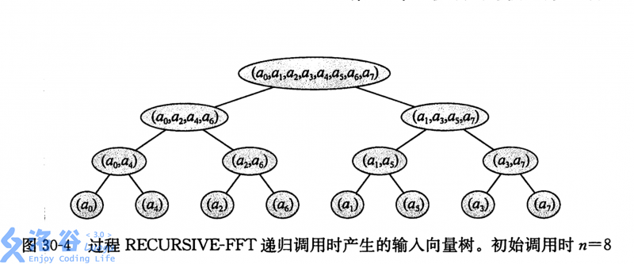
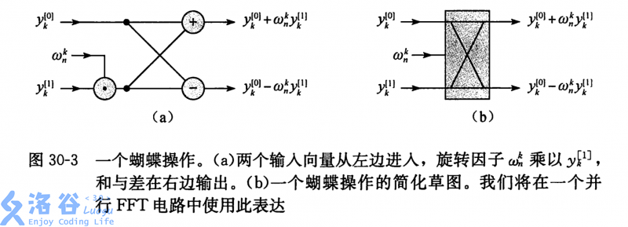

---
##-- draftstate --##
draft: false
##-- page info --##
title: "简单多项式学习笔记"
date: 2020-08-09T18:20:11+08:00
categories:
- OI
- 学习笔记
tags:
- 数学
- 多项式
series:
##-- page setting --##
pinned: false
libraries:
- mathjax 
##-- toc setting --##
hideToc: false
enableToc: true
enableTocContent: true
##-- author --##
# author: ""
# authorEmoji: 
# authorImageUrl: ""
# authorImage: ""
# authorDesc: ""
# socialOptions:  
#   email: ""
#   facebook: ""
---

## 多项式（概念）

### 定义
一个以 $x$ 为变量的多项式是一个定义在代数域 $F$ 上的 $A(x)$ ，其可以表示为：
$$
A(x) = \sum_{j=0}^{n-1} a_jx^j
$$

### 表示
#### 系数表示法
在多项式 $A(x)$ 中，我们称 $\overrightarrow{a} = (a_0,a_1,a_2,...,a_{n-1})$ 为多项式 $A(x)$ 的系数向量。其即为多项式的系数表达。

#### 点值表示法

我们把互不相同的 $x_0,x_1,...,x_{n-1}$ 作为 $x$ 代入多项式，得到 $y_j = A(x_j)$ ，此时我们称 $\{(x_0,y_0),(x_1,y_1),...,(x_{n-1},y_{n-1})\}$ 为多项式 $A(x)$ 的点值表达。其中所有的 $x_j$ 都互不相同。

##### 唯一性

对于 $n$ 个点值对组成的集合 $\{(x_0,y_0),(x_1,y_1),...,(x_{n-1},y_{n-1})\}$ ，可以确定唯一的系数表示法 $\overrightarrow{a}$ 。这个过程又被称为**插值**。

详见：拉格朗日插值法。

### 运算

##### 系数表示下

两个多项式 $A(x)$ 和 $B(x)$， $A$ 和 $B$ 的系数表示分别为：

$$
A(x) = \sum_{j=0}^{n-1} a_jx^j,\quad
B(x) = \sum_{j=0}^{n-1} b_jx^j
$$

##### 加法

若 $C(x) = A(x) + B(x)$ ，那么 $C(x)$ 的系数表示就可以写作：
$$C(x) = \sum_{j=0}^{n-1} (a_j+b_j) x^j$$

##### 乘法

若 $C(x) = A(x)B(x)$ ，那么 $C(x)$ 的系数表示就可以写作：
$$C(x) = \sum_{j = 0}^{2n-2}c_j x^j$$

其中：
$$c_j = \sum_{k = 0}^{j} a_k b_{j-k}$$

#### 点值表示下

设 $A$ 的点值表达为 $\{(x_0,y_0),(x_1,y_1),...,(x_{n-1},y_{n-1})\}$ ， $B$ 的点值表达为 $\{(x_0,y_0‘),(x_1,y_1’),...,(x_{n-1},y_{n-1}‘)\}$ 。

##### 加法

若 $C(x) = A(x) + B(x)$ ,那么 $C(x)$ 的点值的表达就可以写作：
$$\{(x_0,y_0+y_0'),(x_1,y_1+y_1'),...,(x_{n-1},y_{n-1}+y_{n-1}')\}$$

#### 乘法

这里因为最后乘得的是一个次数界为 $2n$ 的多项式，这里 $A$ 和 $B$ 的点值就都得有 $2n$ 对。

若 $C(x) = A(x)B(x)$ ，那么 $C(x)$ 的点值的表达就可以写作：
$$\{(x_0,y_0y_0'),(x_1,y_1y_1'),...,(x_{2n-1},y_{2n-1}y_{2n-1}')\}$$

可以发现，点值表示在多项式的运算方面明显具有速度上的优势。

## 多项式乘法（快速傅立叶变换）

### 定义

快速傅里叶变换（Fast Fourier Transform, FFT）是一种可在 $O(n \log n)$时间内完成的离散傅里叶变换（Discrete Fourier Transform, DFT）算法，在 OI 中的主要应用之一是加速多项式乘法的计算。

离散傅立叶变换，在这里即指将一个多项式的系数表示法转化为点值表示法的过程。

### 前置知识：

+ 复数

### 过程

首先将多项式的次数界补足成为 $2^n$ ，以方便后续的策略。

下文提到的点值向量默认为在单位根的 $0$ 到 $n-1$ 次幂处取得。

下文所有的数均默认在复数域中讨论，包括系数、多项式的值。

深刻建议读者拿笔和纸把这一部分自己手算进行验证。

#### DFT
设多项式 $A(x)$ 系数表达为：
$$
A(x) = \sum_{j = 0}^{n-1} a_jx^j
$$

将 $n$ 次单位根的 $0$ 到 $n - 1$ 次幂，即 $\omega _n^0,\omega _n^1,...\omega _n^{n-1}$ ，带入多项式的系数表示，所得点值向量 $(y_0,y_1,...,y_{n-1})$ 称为其系数向量 $(a_0,a_1,...,a_{n-1})$ 的**离散傅里叶变换**。

按照朴素算法求得 DFT ，则时间复杂度为 $O(n^2)$ 。

##### 改进：FFT

由于我们要对问题进行分治处理，所以我们想办法减小这个问题的规模。

我们根据次数奇偶对 $A(x)$ 的所有项进行分类。即：
$$
A(x) = (a_0 + a_2x^2 + ... + a_{n-2}x^{n-2}) + (a_1x + a_3x^3 + ... + a_{n-1}x^{n-1})
$$

注意到我们如果令：
$$
A_0(x) = (a_0 + a_2x + ... + a_{n-2}x^{\frac{n}{2}-1})\\
A_1(x) = (a_1 + a_3x + ... + a_{n-1}x^{\frac{n}{2}-1})
$$

那么：
$$
A(x) = A_0(x^2) + xA_1(x^2)
$$

注意到 $A_0$ 和 $A_1$ 都是 $A$ 的子问题，我们试图减小数据范围的同时快速的通过 $A_0$ 和 $A_1$ 得到 $A$ 。

若 $k<\frac{n}{2}$ （上半圈），将 $\omega_{n}^{k}$ 代入上式得：
$$
\begin{aligned}{}
A(\omega_{n}^{k}) = & A_0(\omega_{n}^{2k})+\omega_{n}^{k}A_1(\omega_{n}^{2k})\\
 = & A_0(\omega_{\frac{n}{2}}^{k})+\omega_{n}^{k}A_1(\omega_{\frac{n}{2}}^{k})
\end{aligned}
$$

同理可得（下半圈的）：

$$
A(\omega_{n}^{k+\frac{n}{2}}) =  A_0(\omega_{\frac{n}{2}}^{k})-\omega_{n}^{k}A_1(\omega_{\frac{n}{2}}^{k})
$$

所以我们注意到我们只需要知道 $A_0(x)$ 和 $A_1(x)$ 在 $\omega_{\frac{n}{2}}^{0},\omega_{\frac{n}{2}}^{1},...,\omega_{\frac{n}{2}}^{\frac{n}{2}-1}$ ，的值，然后就可以 $O(n)$ 的求得 $A(x)$ 在 $\omega_{n}^{0},\omega_{n}^{1},...,\omega_{n}^{n-1}$ 的值，也就用 FFT 完成了我们的 DFT 过程。

求 $A_0(x)$ 和 $A_1(x)$ 的过程完全是一个设定好系数向量 $(a_0,a_2,...,a_{n-2})$ 或者 $(a_1,a_3,...,a_{n-1})$ 就可以直接递归的一个子问题，而且每次递归过程所花的时间就是只与当前数据范围有关的 $O(n)$ 。

总时间复杂度是 $O(n \log n)$ 。

#### IDFT

将多项式在$n$ 次单位根的 $0$ 到 $n - 1$ 次幂，即$\omega _n^0,\omega _n^1,...\omega _n^{n-1} $处点值向量$(y_0,y_1,...,y_{n-1})$通过插值等办法转换为唯一的多项式系数向量$(a_0,a_1,...,a_{n-1})$的过程称为**离散傅里叶逆变换（IDFT）**。

如果运用拉格朗日插值去直接求得的话，时间复杂度是$O(n^2)$。

##### 改进：FFT

我们通过一系列的推导后会发现仍然可以使用上面已经定义好的使用 FFT 优化的 DFT  来完成这里的 IDFT 。

因为 DFT 求的是从系数到点值，所以我们需要假装这里有一个多项式 $B(x)$ ，然后把它转化成点值，寻找其与原来多项式的系数的关系。

令
$$
B(x) = \sum_{j = 0}^{n-1} y_jx^j
$$

令其经过一次离散傅立叶变换之后得到在单位根的 $0$ 到 $n-1$ 次幂的**共轭复数**，即 $B(x)$ 在 $w_n^{0},w_n^{-1},...,w_n^{-(n-1)}$ 处的点值向量为 $(c_0,c_1,...,c_{n-1})$ ，其中：
$$
c_k = \sum_{i=0}^{n-1} y_i (\omega_n^{-k})^i
$$

由于
$$
y_i = \sum_{j = 0}^{n-1} a_j(\omega_n^i)^j
=  \sum_{j = 0}^{n-1} a_j(\omega_n^j)^i\\
$$

代入之后得：
$$
c_k = \sum_{i=0}^{n-1} (\sum_{j=0}^{n-1} a_j(\omega_n^j)^i) (\omega_n^{-k})^i\\
= \sum_{j=0}^{n-1} a_j(\sum_{i=0}^{n-1} (\omega_n^{j-k})^i) \\
$$

令
$$
S(x) = \sum_{i=0}^{n-1}x^i
$$

则有如下结论（可以通过复数单位根的性质自行证明）:
$$
S(\omega_n^k)=
\begin{cases}
0,& k\neq 0\\
n,& k=0
\end{cases}
$$

则在上上上式可以写作：
$$
c_k = \sum_{j=0}^{n-1} a_jS(\omega_n^{j-k}) \\
$$

当$j = k$时，$S(\omega_n^{j-k})$为$n$，否则该项为$0$。

所以可以得到结果：
$$
c_k = na_k
$$
- - -
所以简略总结一下$IDFT$：

设多项式
$$
A(x) = \sum_{j = 0}^{n-1} a_jx^j
$$

经过一次离散傅立叶变换之后在 $n$ 次单位根的 $0$ 到 $n - 1$ 次幂，即 $\omega _n^0,\omega _n^1,...\omega _n^{n-1}$ 处的点值向量为 $(y_0,y_1,...,y_{n-1})$ 。

则如果将 $(y_0,y_1,...,y_{n-1})$ 当作系数再一次进行离散傅立叶变换，其在 $n$  次单位根的 $0$ 到 $n - 1$ 次幂的**共轭复数**，即 $\omega _n^0,\omega _n^{-1},...\omega _n^{-(n-1)}$ 处的点值向量为 $(c_0,c_1,...,c_{n-1})$ 。

那么这个时候， $a_k = \frac{c_k}{n}$ 。

#### 一种高效的迭代实现

以上的$FFT$的过程是递归的，所以效率不高。

而我们通过对**递归计算顺序**的归纳之后，可以发现如下规律：



*最下层从左到右的数及其二进制表示为：$0(000),4(100),2(010),6(110),1(001),5(101),3(011),7(111)$*

可以发现，每个位置上的计算顺序恰好是原来数字的二进制反转。而对于这 $n$ 个数的二进制数反转可以通过如下算法在 $O(n)$ 的时间完成。

利用一个类似 dp 的思想，用 $rev[i]$  代表对 $i$ 进行二进制翻转之后的结果，那么这个时候我们有如下的结论：
```cpp
rev[i] = (rev[i>>1]>>1) | ((i&1) << (len-1));
```

参考：[FFT中的二进制翻转问题 | GGN_2015的博客
](https://blog.csdn.net/GGN_2015/article/details/69518685)
- - -

所以我们可以按照这个树的顺序，从下到上，从左到右，依次计算对应的 DFT 点值。然后用$O(len)$ 的时间合并。

注意到这个递归树一共有 $\log n$ 层，每层的长度都是 $n$ ，所以时间复杂度仍然是 $O(n\log n)$ 。

- - -
具体来说，大概就是：

开始的时候，数组里每个位置放的都是这个位置的点值，因为在 $n = 1$ 并没有变量 $x$ 。

这个时候再进行向上的合并。处理到从下往上数的第 $i(i\in[0,log_2 n])$ 层，那么这个时候我们需要处理的点值个数就是 $2^{i}$ 个。

如果把当前正在处理的是 $A(\omega_n^k)$ 。在处理之前，我们假设在这 $2^{i}$ 的区间的左边 $2^{i-1}$ 个元素依次放置的是 $A_0(\omega_{\frac{n}{2}}^{k})$ ，右侧依次放置的是 $A_1(\omega_{\frac{n}{2}}^{k})$ 。处理之后，我们希望在这 $2^i$ 个位置依次放置的是 $A(\omega_n^k)$ ，来使我们上面的处理之前的假设成立。

我们运用上面推导出的公式：
$$
\begin{aligned}{}
A(\omega_{n}^{k})  = & A_0(\omega_{\frac{n}{2}}^{k})+\omega_{n}^{k}A_1(\omega_{\frac{n}{2}}^{k})\\
A(\omega_{n}^{k+\frac{n}{2}}) =&  A_0(\omega_{\frac{n}{2}}^{k})-\omega_{n}^{k}A_1(\omega_{\frac{n}{2}}^{k})
\end{aligned}
$$

这个时候 $A_0(\omega_{\frac{n}{2}}^{k})$ 就在当前区间左半边的第 $k$ 个位置上，而 $A_1(\omega_{\frac{n}{2}}^{k})$ 就在区间右半边的第 $k$ 个位置上。

事实上可以发现 $A_0(\omega_{\frac{n}{2}}^{k})$ 在数组中的位置就是 $A(\omega_{n}^{k})$ 在数组中的位置，而 $A_1(\omega_{\frac{n}{2}}^{k})$ 在数组中的位置就是 $A(\omega_{n}^{k+\frac{n}{2}})$ 在数组中的位置。

所以对于这 $n$ 个点值，它们构成 $\frac{n}{2}$ 对，互不干扰，我们只需要把这两个位置上的值取出来，经过运算之后再放回去，就可以完成这对位置上点值的合并计算。

这个过程的形象图解：



这里的 $y_k^{[0]}$ 就是我们的 $A_0(\omega_{\frac{n}{2}}^k)$ ，$y_k^{[1]}$ 就是我们的 $A_1(\omega_{\frac{n}{2}}^k)$ ， $y_k$ 就是我们的 $A(\omega_n^k)$ 。

这种接受两个递归得到的 $A_0$ 和 $A_1$ 值，交叉计算得到 $A$ 的值的操作被称为**蝴蝶操作**。

- - -

简略概括：

通过在递归树上从下到上，从左到右的顺序依次递推，每次得到一对更高层的点值，最后递推得到最终要求的 $n$ 个点值。

#### 代码

这里给出一个[快速傅立叶变换模版题](https://www.luogu.org/problemnew/show/P3803)的`C++`代码：

```cpp
#include <bits/stdc++.h>
using namespace std;
typedef complex<double> complex_t;
const int MAXN = 2610000;

namespace FFT{
const double PI = acos(-1.0);
// op == 1 -> DFT, op == -1 -> IDFT
void fft(complex_t *P,int n,int op){
    // P 传入 n 个系数（复数），op 标记操作
    static int r[MAXN];//r[i] 存储 i 反转二进制后得到的数
    int len = log2(n);//计算二进制位长度（001 -> len = 3）
    for(int i = 0;i < n;i++)
        r[i] = (r[i>>1]>>1) | ((i&1) << (len-1)); //递推计算 r[i]
    for(int i = 0;i < n;i++)// 交换得到最底层序列
        if(i < r[i]) swap(P[i],P[r[i]]);
    for(int i = 1;i<n;i<<=1){// 计算所有长度为(i<<1)的序列的DFT值
        complex_t x(cos(PI/i),op*sin(PI/i));// 该长度下的单位根
        for(int j = 0;j<n;j+=(i<<1)){ // 某一个长度为(i<<1)的序列
            complex_t y(1,0); // \omega_{n}^{0}
            for(int k = 0;k<i;k++,y*=x){ 
                // 计算A(\omgea_{n}^{k})和A(\omgea_{n}^{n/2+k})
                complex_t p=P[j+k],q=y*P[j+i+k];
                // p = A_0(\omgea_{n/2}^{k})
                // q = \omgea_{n}^{k} * A_1(\omgea_{n/2}^{k})
                P[j+k] = p+q,P[i+j+k]=p-q;
                //A(\omgea_{n}^{k}) = p+q, A(\omgea_{n}^{n/2+k}) = p-q
            }
        }
    }
}
}

int n,m;
complex_t a[MAXN],b[MAXN];

int main(){
    scanf("%d %d",&n,&m);
    int t;
    for(int i = 0;i<=n;i++){scanf("%d",&t);a[i] = t;}
    for(int i = 0;i<=m;i++){scanf("%d",&t);b[i] = t;}
    for(m+=n,n=1;n<=m;n<<=1);
    FFT::fft(a,n,1),FFT::fft(b,n,1);// 对两个多项式进行DFT
    for(int i = 0;i<=n;i++) a[i] *= b[i];//点值乘法计算 
    FFT::fft(a,n,-1); // 对点值进行IDFT
    for(int i = 0;i<=m;i++) 
        printf("%d ",int(a[i].real()/n + 0.5));
    return 0;
}
```

### 快速数论变换(`NTT`)

跟 $FFT$ 大致（几乎完全）一样，只需要把复数单位根替换成模形如 $a \times 2^b + 1$ 的质数 $p$，常用质数参见：[Misckoo's Blog](http://blog.miskcoo.com/2014/07/fft-prime-table)
。

#### 代码

```cpp
void ntt(ll *P,int n,int op){
  for(int i = 0;i<n;i++) if(i < r[i]) swap(P[i],P[r[i]]);
  for(int i = 1;i<n;i<<=1){
    ll w = pow((op==1?G:INVG),(MOD-1)/(i<<1),MOD);
    for(int j = 0;j<n;j+=(i<<1)){
      ll wn = 1;
      for(int k = 0;k<i;k++,wn=(wn*w)%MOD){
        ll p = P[j+k],q = wn*(P[i+j+k])%MOD;
        P[j+k] = (p+q)%MOD;
        P[i+j+k] = ((p-q)%MOD+MOD)%MOD;
      }
    }
  }
}
```

### 应用

优化计算卷积。

快速计算形如 $f(i) = \sum g(j) g(i-j)$ 之类问题。

### 参考资料

[FFT详解 | GGN-2015的博客](https://blog.csdn.net/ggn_2015/article/details/68922404) 写的很适合初学者
[FFT学习笔记 | Menci's Blog](https://oi.men.ci/fft-notes/) 有详尽的数学公式，但不适合初学的同学看
[Misckoo's Blog](http://blog.miskcoo.com/2015/04/polynomial-multiplication-and-fast-fourier-transform) 简练，有关于NTT和其应用的简介 质量很高

## 多项式除法、取模

给出两个多项式 $A(x),B(x)$ ，次数分别为 $n,m(n \geq m)$，求满足：

$$
A(x) = Q(x)B(x) + R(x)
$$

且 $R(x)$ 次数小于 $B(x)$ 的次数。

### 原理

**多项式（包括生成函数等）中的 $x$ 可以有双重含义：占位符或者一个复变量。**

这里如果当做占位符，我们可以拿 $\frac{1}{x}$ 代替 $x$ 代入方程，就有：

$$
A(\frac{1}{x}) = Q(\frac{1}{x})B(\frac{1}{x}) + R(\frac{1}{x})
$$

同乘 $x^n$ ，得到:

$$
x^n A(\frac{1}{x}) = (x^{n-m}Q(\frac{1}{x}))(x^m B(\frac{1}{x})) + x^{n-m+1}(x^{m-1}R(\frac{1}{x}))
$$

我们设（事实上就是把系数反了过来） 
$$
A'(x) = x^n A(\frac{1}{x})\\
B'(x) = x^m B(\frac{1}{x})\\
Q'(x) = x^{n-m} Q(\frac{1}{x})\\
R'(x) = x^{m-1} R(\frac{1}{x})
$$

那么

$$
A'(x) = Q'(x)B'(x) + x^{n-m+1}R'(x)
$$

两侧对 $x^{n-m+1}$ 取模得到

$$
A'(x) \equiv Q'(x)B'(x) \pmod{x^{n-m+1}}
$$

$$
Q'(x) \equiv \frac{A'(x)}{B'(x)} \pmod{x^{n-m+1}}
$$

因为 $Q'(x)$ 也就是 $Q(x)$ 的次数正好是 $n-m$ ，刚好全部保留，所以这个地方求出的在模 $x^{n-m+1}$ 意义下的 $Q'(x)$ 就是真正的 $Q'(x)$ 。

余式 $R$ 就把 $Q$ 和 $B$ 用 NTT 乘回去减掉即可...

## 多项式（求逆）

多项式求逆的目的是：

给出多项式 $A(x)$ ，求多项式 $B(x)$ ，使得 $A(x) B(x) \equiv 1 \pmod{x^n}$ 。系数对某个数 $p$ 取模。

### 原理

我们发现，如果我们令 $B'(x)$ 为 $A(x) B'(x) \equiv 1 \pmod{x^{\lceil\frac{n}{2}\rceil}}$ 的解；又有 $A(x)B(x) \equiv 1 \pmod{x^{\lceil\frac{n}{2}\rceil}}$

两式相减得到： $A(x)(B(x)-B'(x)) \equiv 0 \pmod{x^{\lceil\frac{n}{2}\rceil}}$，我们有 $A(x) \not\equiv 0 \pmod{x^{\lceil\frac{n}{2}\rceil}}$，所以有 $B(x) - B'(x) \equiv 0 \pmod{x^{\lceil\frac{n}{2}\rceil}}$ 。

这个式子非常特殊，我们可以推出以下的式子： $(B(x)-B'(x))^2 \equiv 0 \pmod{x^n}$ 。为什么呢？

我们注意到， $B(x) - B'(x)$ 在后 $\lceil\frac{n}{2}\rceil$ 项的值都是 $0$ ，那么平方之后想要凑出一个次数小于 $n$ 的项，则必须含有一个次数在 $\lceil\frac{n}{2}\rceil$ 以下的项，显然必须是 $0$ 。

那么我们就有 $B(x)^2 - 2 B(x)B'(x) + B'(x)^2 \equiv 0 \pmod{x^n}$，两边同时乘上 $A(x)$ 就有 $B(x) - 2B'(x) + A(x)B'(x)^2 \equiv 0 \pmod{x^n}$ ，移项之后就有最后的答案：$B(x) \equiv 2B'(x) - A(x)B'(x)^2 \pmod{x^n}$。

### 实现

+ `cal(A,n)`
    + 如果 $n = 1$，直接返回该数模 $p$ 意义下的逆元。
    + 如果 $n > 1$，我们计算出 `B'(x) = cal(A,ceil(n/2))`
     根据 `B(x) = B'(x) - A(x)B'(x)^2` 并用 $NTT/FFT$ 优化算出 `B(x)`

### 代码

#### 递归版

```cpp
namespace NTT{
  int init(int n);// 初始化 ntt 的各种东西
  void ntt(ll *P,int n,int op);// 进行 ntt 变换
  // ...
}

namespace xxx{
  ll a[MAXN],b[MAXN],A[MAXN],B[MAXN],r[MAXN];
  void work(int n){
    if(n == 1) b[0] = inv(a[0],MOD);
    else{
      int s = (n+1)/2;work(s);
      int t = NTT::init(2*n+2);
      memset(A,0,sizeof(ll) * t),memcpy(A,a,sizeof(ll) * n);
      memset(B,0,sizeof(ll) * t),memcpy(B,b,sizeof(ll) * s);
      NTT::ntt(A,t,1),NTT::ntt(B,t,1);
      for(int i = 0;i<t;i++)
        r[i] = (2-A[i]*B[i]%MOD+MOD)*B[i] % MOD;
      NTT::ntt(r,t,-1);
      memcpy(b,r,sizeof(ll) * n);
    }
  }
  void getinv(ll *P,int n){
    memcpy(a,P,sizeof(ll) * n);
    work(n);
    memcpy(P,b,sizeof(ll) * n);
  }
}
```