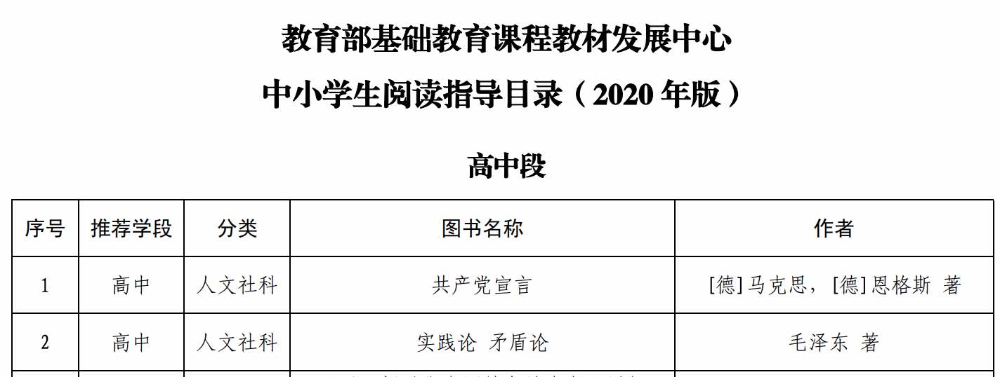

---
##-- draftstate --##
draft: false
##-- page info --##
title: "「读书笔记」《文心》"
date: 2020-12-20T00:10:45+08:00
categories:
- 读书笔记
tags:
- 文学
series:
##-- page setting --##
# slug: ""
# type: ""
pinned: false
libraries:
- mathjax 
##-- toc setting --##
hideToc: false
enableToc: false
enableTocContent: false
---

>  夏丏尊 叶圣陶著，北京：生活·读书·新知三联书店，2005 年 1 月。

<!--more-->

在写作与沟通课上读到了《文心》中的一篇文章，给我留下了十分惊艳的印象。摘录一段如下：

> 已是榴花照眼的时节了。大气中充满着温暖，使人卸去了夹衣，只穿着单衫，四肢百骸都感到轻松舒适的快感。这一天是星期日，大文早上起来，并不见谁来找他闲谈，也没有预期的约会......
> 早餐过后，他预备做功课了。坐到椅子里，书桌上一本伯伯的线装书吸引住他的注意。这是唐朝司空图的《诗品》...王先生对一班同学说的话：“研究文章的风格，司空图的《诗品》不妨找来一看。......”
>
> ...顺次读下去，读到“自然”一品，他又仿佛颇有所悟。“俯拾即是，不取诸邻。俱道适往，着手成春。如逄花开，如瞻岁新。真与不夺，强得易贫。幽人空山，过雨采蘋。薄言情悟，悠悠天钩。”他想作诗、作文而能“俯拾即是”，不去强求，不讲做作，那就是所谓“有什么说什么”，“爱怎么说、该怎么说就怎么说”，真达到“自然”的极点了。这又与漫无节制，信笔乱挥不同。一方面“俯拾即是”，一方面却又“着手成春”，只因为工夫已经成熟，在无所容心之间，自能应节合拍的缘故。所以一篇完成，就像花一般开得异常美好，节令一般来得异常适合。花开和节令迁流看来都是自然不过的事，然而雨露的滋润，土壤的荣养，日月的推移，气候的转换，中间费却造物的几许匠心啊。这便是“真与不夺”；换句话说，必须内里充实，作起诗与文来才能“俯拾即是”，才能“着手成春”。如果内里并不充实，也想信口开河，提笔乱挥，取得“自然”的美名，结果必然不成东西，徒然使自己后悔，供人家嘲笑；这便是“强得易贫”了。
>
> 他把这一点心得玩味了一会，眼光重又注射到书页上，对于“含蓄”一品的“不着一字，尽得风流”；“精神”一品的“明漪绝底，奇花初胎”；“疏野”一品的“倘然适意，岂必有为”；“清奇“品的“神出古异，淡不可收；如月之曙，如气之秋”；“委曲”一品的“似往已回，如幽匪藏；水理漩洑，鹏风翱翔；道不自器，与之圆方”；“形容”一品的“风云变态，花草精神；海之波澜，山之嶙峋；俱似大道，妙契同尘；离形得似，庶几斯人”：他都能深深地领会。他好似神游于文艺的展览会，那些展览品完全脱去形迹，各标精神使他不得不惊叹于文艺界的博大和繁富。
>
> 他想起现代一班作家的作品：朱自清的称得起“缜密”，周作人的可以说“自然”，茅盾的不愧为“洗练”，鲁迅的应号作“劲健”。他又想起古昔文学家的作品：同样是词，而苏辛的与温飞卿的不同，苏辛的“豪放”，而温飞卿的“绮丽”；同样是散文，而司马迁的与陶渊明的不同，司马迁“浑雄”，而陶渊明的“冲淡”。如果把读过的一些散文、诗、词，逐一给它们比拟，这近于什么风格，那近于什么风格，倒也是有味的事情呢。但是他随即想到司空图的二十四品实在也未尝不可增多，不然，何以王先生又曾提及还有人作《续诗品》及《补诗品》呢？既可以增补，当然也不妨减少或者合并。可见二十四品并非绝对的标准，又何能据此来衡量一切的作品。况且，王先生提出的题目原是很宽广的，只说“对于文章的风格作一点研究，写一篇笔记”罢了，并不曾教大家去判别读过的文篇的风格呀。

忙里偷闲，花了五六天读完了这本“故事书”，它没有让我失望。

这本书讲的是“国文”这门科目，也就是我们今天说的“语文”。

语文该怎么学？这个问题实在太难了。从我自身的经验来看，过去十二年我所经历的语文学习和教学，始终都在回避这么一个问题：我们学的语文应该是什么？我们学语文的目的应该是什么？

我们的语文科目，演变成了在考场上读-写二元的游戏；我们所面对的不是丰富的文字世界，而是单调的题目组合。我们的语文教学，杂乱而不成章法。可有一位语文教师能够按照教学的规划完整的完成教学？可有一位教师三年以来的讲课内容连起来能成为清晰的、立体的知识体系？可有一位语文教师能够告诉我们，语文到底是什么？这不是教师的问题，而是我们整个语文教学体系和方法论的缺憾。

我认为，这本书中对于语文这门学科概括的凝练程度，比我们现在的“语文”教材不知道高到哪里去了。你是否有过这样的疑问：如何读书，又如何写成读书笔记？如何写作，又如何修改自己的作品？如何鉴赏，又如何琢磨最抽象的“风格”？如何朗诵，又如何调整自己的语音语调？这本书里用一个个小故事呈现了这些语文学科中的要点，称得上“提纲挈领”。将学科体系化，尤其是像“国文”这样彻头彻尾的人文学科体系化，需要极强的功底，两位大家在这里做到了。

举一个例子吧，免得被以为是“空谈”：

> 走了几步，枚叔又说：“从前我在学校里教课，一班学生作文，不懂得印象的描写，总是”美丽呀“、”悲痛呀“、”有趣呀“、”可恨呀“，接二连三地写着。我对他们说，这些词语写上一百回也是不相干的，因为它们都是空洞的形容，对于别人没有什么感染力。必须把怎样美丽、怎样悲痛、怎样有趣，怎样可恨用真实的印象描写出来，人家才会感到美丽、悲痛、有趣和可恨。他们依了我的话，相约少用“美丽呀”......这些词语，注重随时随地观察，收得真实的印象，用作描写的材料。后来他们的文字就比较可观了。“
>
> ——十·印象

诸如这样的例子数不胜数，相信读到这段文字各位已经对这本书有了一个直观的印象了。

这本书不是套了一层皮的说教，其中更有人生的意味可以琢磨。小到个人：枚叔的失业，乐华进工厂，两对小情侣的”恋爱“；大到国家：一·二八事件，抗日救亡...这本书并不建构于“虚空”，而是在某一维的现实中真实存在的。在这样的时代背景下，在这样的人生命运下，用“国文”知识应该做些什么？那些各种各样的文学形式——如“戏剧”、“日记”、“现代诗”，又应该发挥什么样的作用？一定程度上来看，这不仅是语文问题，更是人生的难题。

还有一点与本书无关的感受：作为一个理工学生，我认为我接受到的人文教育，实在太少。诚然，时代的客观条件使我们必须看重那些有利于选拔，有利于快速发展的学科；但是不是可以慢慢往回调整这种对于立竿见影的“效果”的追捧了了呢？比如对于历史，对于哲学的学习，我认为在整个教育过程中都是大大不够的，虽然确实这些东西对于“建设社会主义”可能没有直接的作用，但这些是一个人，作为之前一切**社会历史关系的总和**的立身之本。虽然这些人文学科也可能在选拔的压力下变成语文一样的“走过场”，但总比没有好吧...

另外的一些摘抄：

> “...换一句说，高中的国文教材应该是‘历代文学作品选粹’一类的东西“...“
>
> ”国学是一个异常不妥当的名词。文字学是国学，历代各家的本体论、认识论是国学，《尚书》和《左传》是国学，诗、词、歌、赋也是国学，好比不伦不类的许多人物穿着同一的外衣，算什么意思呢？按照本质归类，成为文字学、哲学、史学、文学，岂不准确、明白？“
>
> ”不知道对待思想、学术不能凭主观的爱憎的，最重要的在能用批判的方法，还它个本来面目。说的明白点，就是要考究出思想、学术和时代、社会的关联；他因何发生，有因何衰落。“
>
> “文章的组织方法...就是‘回问自己’四个大字”

写读书笔记之前在网上一搜，这本书位列教育部编写的初中生[阅读指导书目](http：//www.moe.gov.cn/jyb_xwfb/gzdt_gzdt/s5987/202004/W020200422556593462993.pdf)；而我在大学才读到它，实在非常惭愧。但看到高中段的开头...

哦，那没事了...

大概他们也没指望学生真的按照这个书单读吧...

