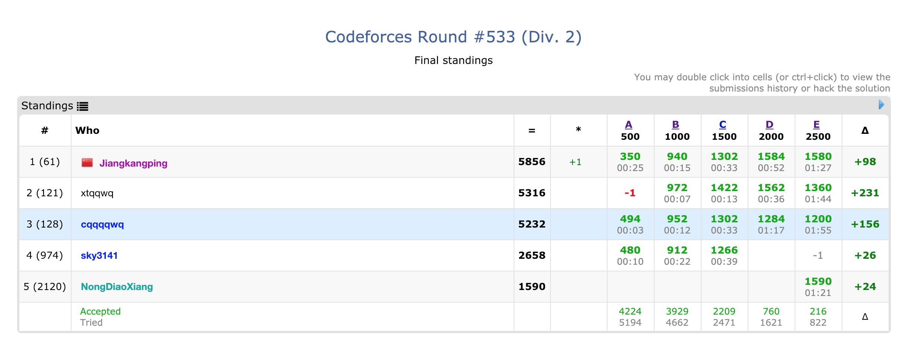

本游记是真的游玩过程记录。

<!--more-->

这篇文章每个阶段都是过完就直接写了...有可能比较啰嗦，会有比较多的心理啥的吧...

## Day-?,2019-12-xx

不可描述。

### upd on Day1

渐渐后悔。我也许就不应该接受的吧。

## Day-2,2019-01-19

若干天前订好了乘坐CA1315航班从北京飞往广州。今天十一点可以值机之后发现，竟然从原来的777-300ER换成了747-8I，感觉有一种中奖的意思。

值机值了一个在飞机最后的位置，应该还算是比较宽敞，只不过是没有靠窗的位置。

回家收拾行李，被训斥不会生活qwq就带了一个大的双肩背包就滚粗了。

## Day-1,2019-01-20

早早到机场，发现飞机早就在等我们了。

还看到了一个汉莎的747-8降落，太美了。也看到了国航彩绘的 77W ，感觉十分舒适。上飞机前还看了一集空中浩劫，感觉十分舒适。

上飞机之后不到五分钟就把自己的小电视搞坏了，于是开始写代码。

写 SA 写到一半发现座位底下的插座充不上电，于是收起电脑开始玩手机，发现并没有单机游戏，于是就开始颓废，

广州的云超级低 & 厚，到了 1200 米以下之后才能勉强看到地面，所以虽然我们从南侧进场五边下面经过广州市区，但是什么都看不见.jpeg，

下飞机之后就是去酒店，从市区北边巨远到市区东边巨远的酒店先住一晚上。几天前就知道要和可爱的（并不）男孩子住一个大床房，还有些激动（并不）。

到了酒店之后发现酒店有一个阳台，景色超级美丽的诶！直接促成了我决定在23号晚上溜出来在酒店住一晚上，

晚饭之前另一屋在玩炉石，我过去开了一包搞出来个橙卡，据说rp--？？？

晚饭去吃了蒸汽火锅（也许不是），感到非常赛艇。

这天晚上还有一场 8 点的 Div2 的 CF ，于是四人开黑局，结果是一个奇葩场，ABC三道SB题，D是个模拟，E是个爆搜？？？我学的算法有什么用吗？？？不会做 E，询问隔壁神仙，得到回复：“爆搜，” 然后就 PP 了，

赛后特别搞笑，某人的 E 被同屋神仙 X 掉了，然而并没有FST，令人发指，

## Day1,2019-01-21

七点半起床，感到非常舒适，大概是近若干天睡的最多的一次..？早上吃饭，看到一车长郡的同学（忽然害怕），估计所有人都比我厉害（快哭了）

吃完饭尾随长郡大军前往广州二中，长郡的人走的巨快，甚至完全跟不上他们的走路，巨佬们果然擅长走路...

到地方之后领了胸牌，领了衣服，领了袋子，然后去宿舍，宿舍是在旁边的实验学校，大概离考试的地方有一个大操场+一栋大楼那么远。

这个大操场很nice，有10个跑道，还是天然草（虽然我们到的时候已经几乎只剩下土了），篮球场有10块，（简单寻觅），还有室内的带看台的篮球馆&羽毛球馆，比破校简直不知道高到哪里去了。

然后就是试机，电脑还不错，有的时候有阳光真是非常emmm，VSCode环境妙啊，配完之后敲了个后缀数组和FWT，后缀数组还敲错了好多（捂脸）FWT甚至没有写完，感到非常不妙。

一路围观神仙不敢搭话，于是回宿舍待了会。宿舍存在一个机器不断挖土（捣地）发出巨大的声音。在宿舍看了看 LCT 板子，和一大堆其他的板子，然后就要去吃饭了。

吃饭的地方和一大堆广州二中的学生一起吃了饭，盛饭盛的巨多，甚至没有吃完...

下午的考试不提，大概就是均分200菜鸡分数40...成为学校 rk-1 ...自己讲过的莫队都不会，把问题想成二维的然后就偏偏了...心情不是很好，大概需要继续认清自己菜鸡的事实。

开幕式没什么好玩的。讲话 * n。

广东的妹子平均质量比北方高。嗯。

感觉并不是非常好，在考场上坐了5个小时啥都不会的感觉真的让人自闭。第一次（也许省选的时候才是第一次）感到这么绝望...你希望能够做好的事情却没有改变的能力...也许三个月前根本就不应该继续呢...

## Day2,2019-01-22

早饭没什么好玩的qwq

早上八点钟到考场坐好，考试没啥好玩的...A掉了T1之后不会求凸包，卡在T3不能动弹，又混了个比大众分--的分数，令人不爽qaq

发现这个学校的基础设施真是好啊，还有露天的游泳池...不知道比我们高到哪里去了qaq

吃完饭和本校选手谈笑风生，大家谈论自己挂的分emmm惨案现场...

晚上考试令人自闭...又困又累...

一共八道题，3h。工程实现大赛，库函数实现大赛...卡在T4发现要实现CRC，然后直到考试结束前30分钟才发现CRC可以暴力！真令人自闭...

