> 衡水市，2017年常住人口446.0万人，GDP1550.1亿元，人均GDP3.47万元，衡水市教育局预算支出68644.4万元。

> 北京市海淀区，2017年常住人口348.0万人，GDP5915.3亿元，人均GDP17.00万元，海淀区教育委员会预算支出1038648.0万元。

X大附中，高中在校生约3000人，一本率近100%，清北录取人数119人。

河北衡水中学，在校生约10000人，一本率超过85%，清北录取人数175人。

<!--more-->

## 写在前面

2018年4月29日，我去衡水参观了衡水中学的开放日。参观的时间和内容都不是很充分，我作为一个知名“素质教育”学校的学生，某些事情上的观点有可能并不准确和正确。如有这些情况，可以留言告知，我会酌情删改。

## 引子

2018年4月29日，河北省衡水市。晴，18-31摄氏度。

驱车五个小时，终于从北京到达了衡水。

总是说要出北京去见见世面，去观察那些不是那么熟悉的地方，所以一看到衡中开放日，就暗暗下定决心，要去这所只在新闻里听闻过的学校。以至于后面几天听说清华的校庆可以去观礼，也仍然去了衡水。甚至就在去之前的一天，还跟同学开玩笑说：“您去清华签约，我只能去衡水复读了。”

早上的路程说不上顺利。六点钟就从北京出发，一路目睹了许多追尾车祸，最后竟11点才到了衡中门口。

下了车，就拿好东西，向衡中的大门缓缓走去。那时正是中午，天气很热，天空上也没有一点的浮云，穿上短袖也感到少许闷热。突然间，衡中的大门就出现了在眼前。

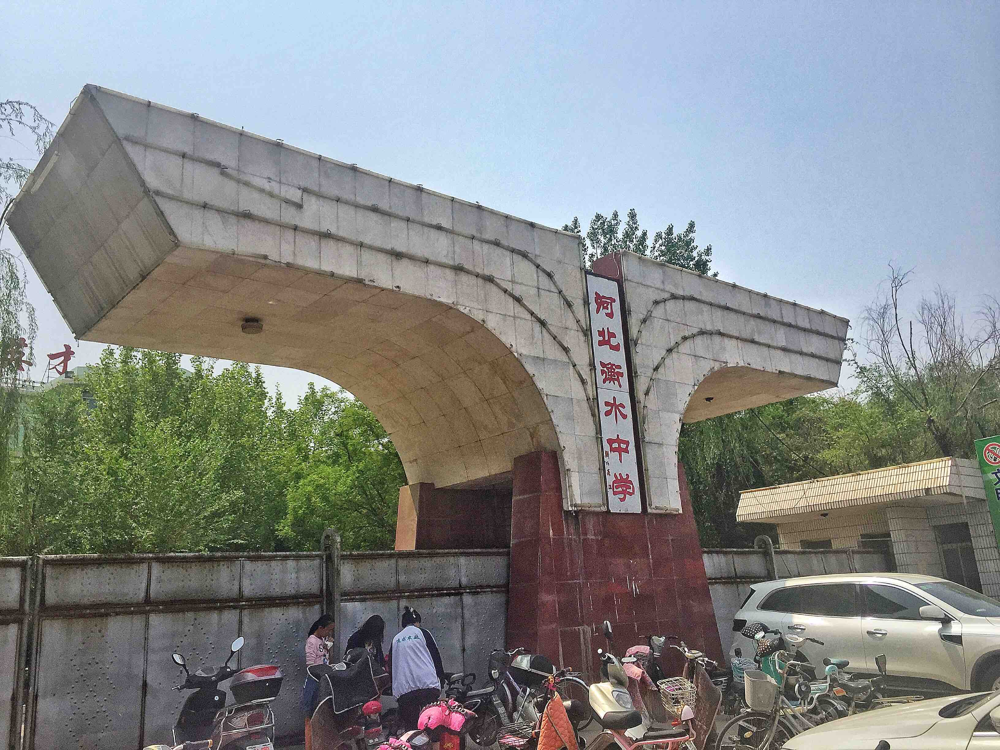

*衡水中学正校门：酷似首都师范大学*

从停车处走到校门的路上，一路的景象也让我不禁唏嘘。一条笔直的大道，路旁的店铺则大多与教育有关，甚至还有在地上摆了一地高中教材和五三的小贩。脚下的道路虽然已经硬化，但是仍然不甚平整。在大门口，停满了各种各样的电动车和三轮车，车上撑着遮阳伞的小摊贩也举目可见。如果你不说这里是衡水中学，那么我一定会把这个一个省最强，乃至全国最强的中学之一的学校当作一个普通十八线小县城的一所普通的高中。

然而这是衡水中学。

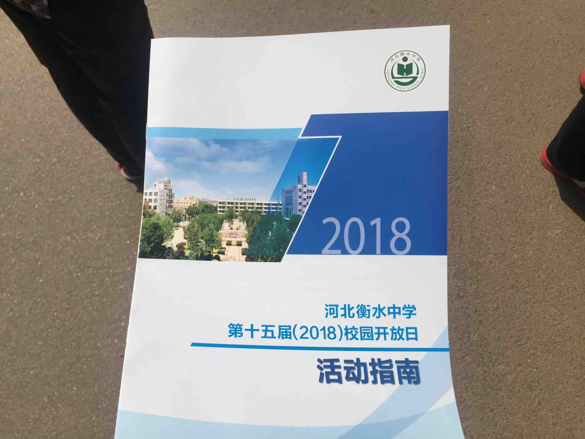

*图：证明确实去过*

## 校园

衡中的校园，其实并不和X大附中的校园的格局有什么多大的区别。但相比于X大附中，衡中的校园显得更大一些。

### 0x01

进门的左手边就是一门大炮和一个小湖。

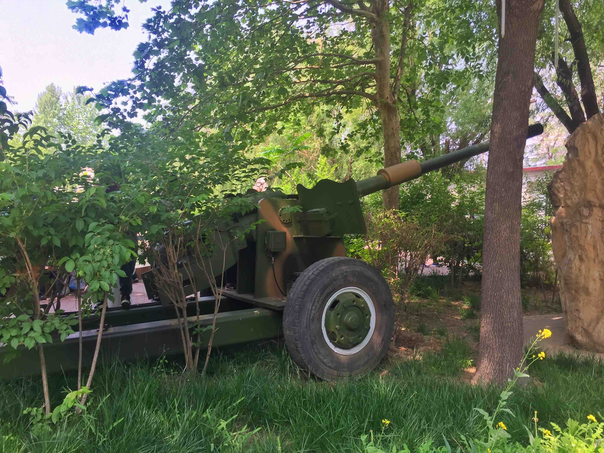

*图：神奇的加农炮*

不止左手边是一门大炮，右手边就是一台62坦克。果然是又红又专啊！到处都是关于十九大和今年的人大换届的展板，政治觉悟实在是高！

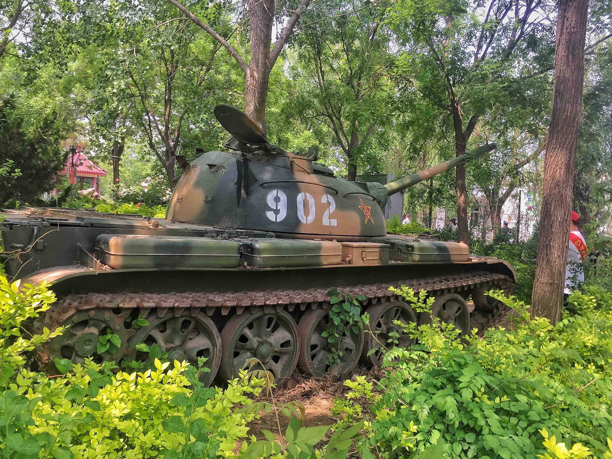
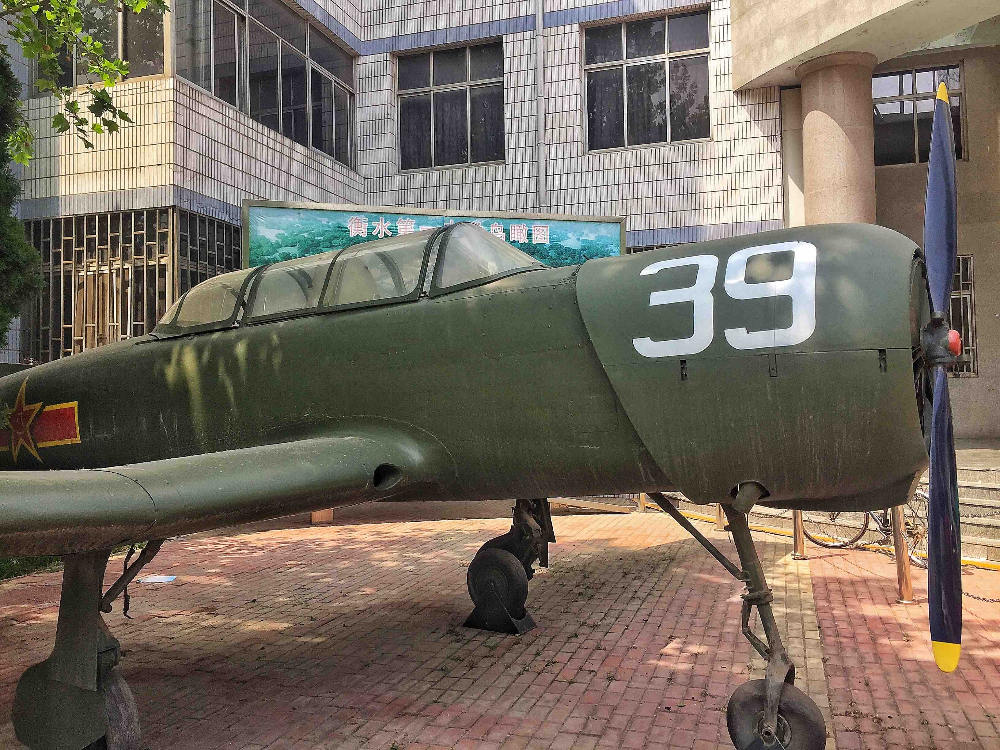

*图：62式坦克 初教6教练机*

- - -

一直羡慕校园里有水的学校，比如101。如果一个学校里面有活水，那么这所学校的气氛，就一定不会死气沉沉，在其中学习一定会是充满愉快的。遇到什么困难，去看看澄澈的水面，总是会让人觉得人生是充满希望的。但我想人大的一勺之池大约是不算在其中的。

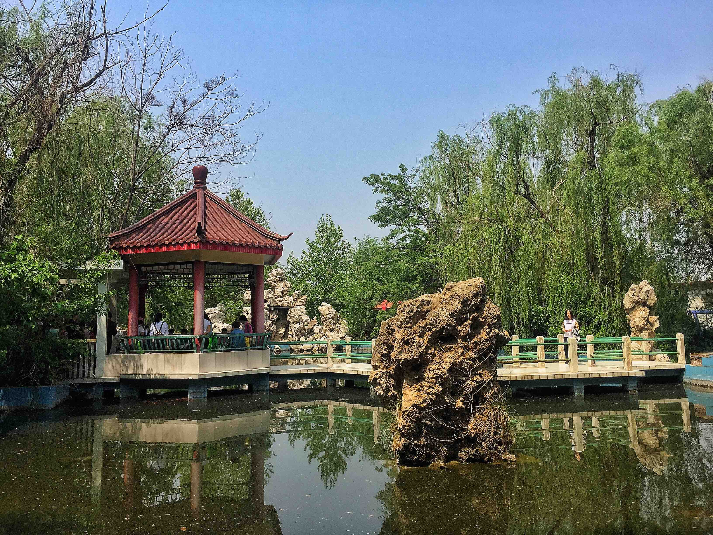

*图：衡中湖*

### 0x02

走到最里面，就是衡中的操场了。

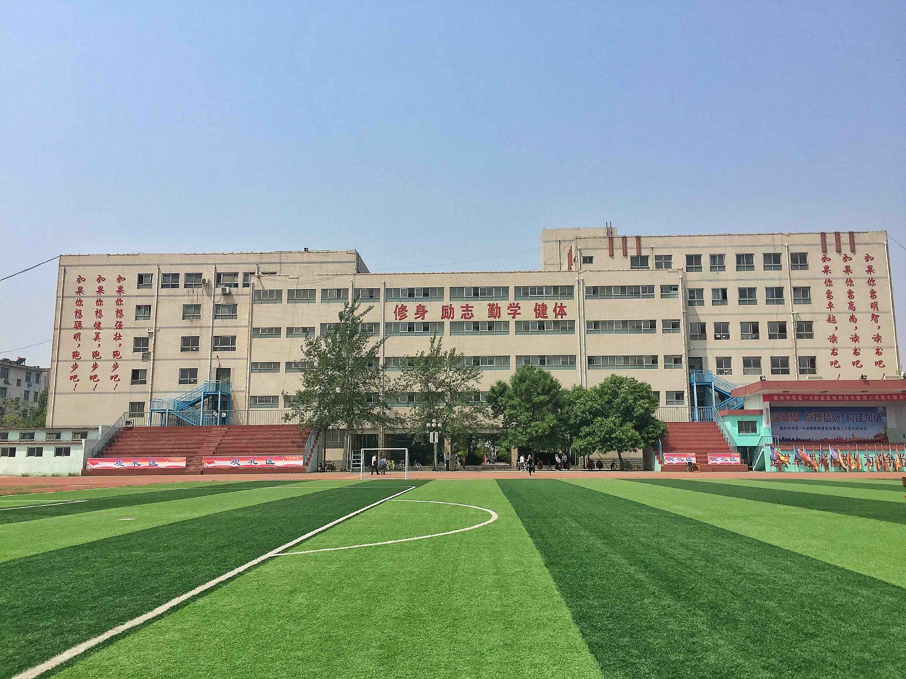

*图：操场及标语*

全世界的操场都是差不多的样子。不过我还是要说...你X大附中每年几个亿的经费能不能修个草皮？？？全世界的草皮都不知道比破校好到哪里去了。

有点特色的就是标语。开始还没什么。站在操场的中央，越读越觉得有趣。没有看到跑操的示范，也不好再说些什么，这个章节就简短一些了。

- - -

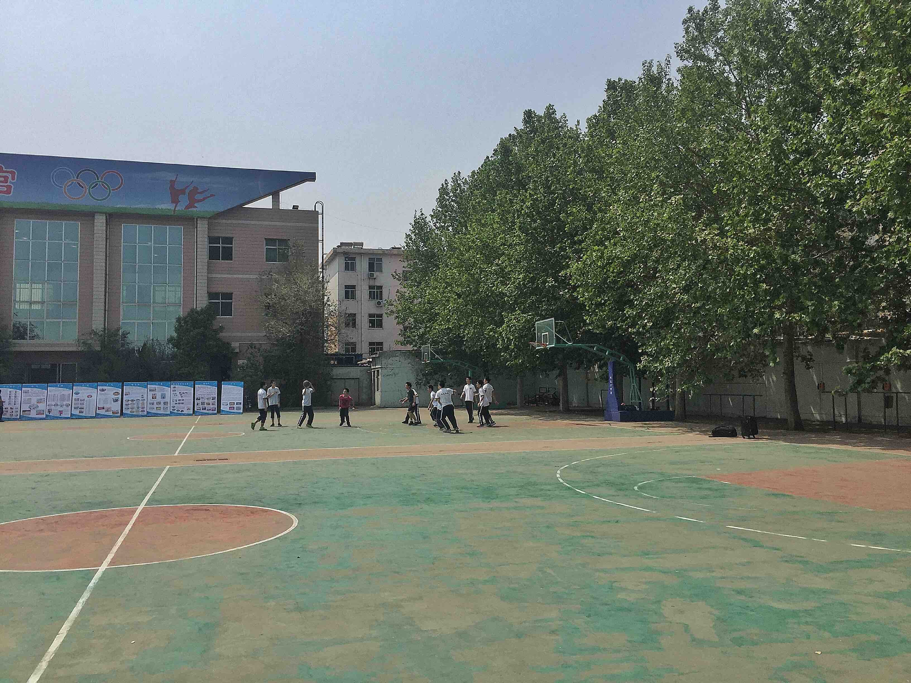

*图：衡水中学的学生正在打篮球*

这张图也让我印象很深刻。衡中的学生，再怎么样，也还可以是学生的嘛。

### 0x03

往外走的路上，在树梢的枝头瞟见高三(or高二？)的教学楼上有着一面几乎分毫不差的大钟。

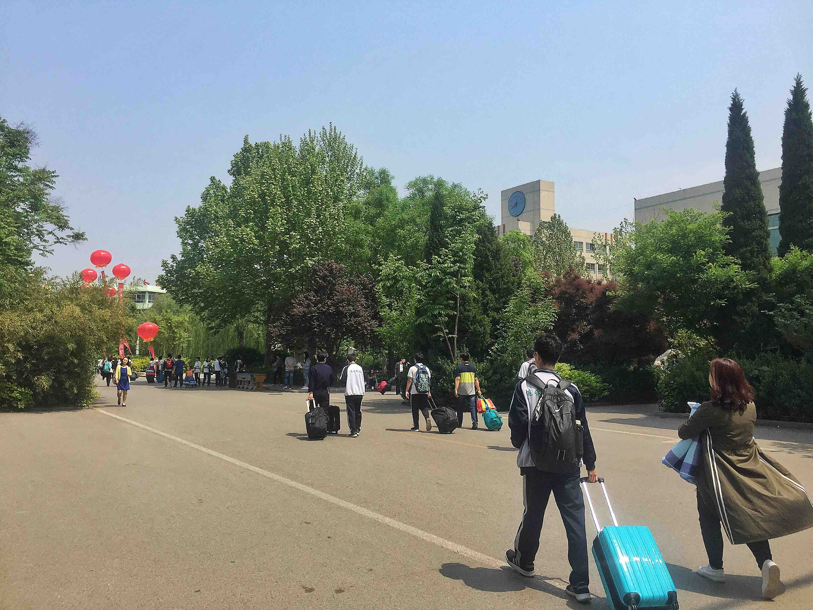

*图：教学楼上的钟*

或许这也是衡中的几乎变态的时间规划的体现吧。刚看到觉得有些意外，但渐渐地也觉得这些东西，也不是什么坏的东西啊。
- - -
趁着家长会偷偷溜进了高一的教室。接下来这一段大概是全文我感觉最有意思的地方了。

我现在也正是高一，所以大约对下高一的学习进度大约是件非常有趣的事情。

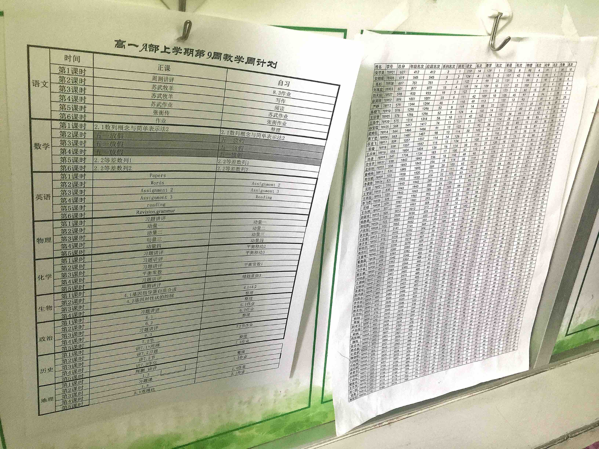

*图：公开贴在楼道的周测（或者期中考试）排名*

毋庸置疑，衡中，尤其其实验班的确是一个学习氛围非常浓厚的地方。也许并不是所有人都想去学习，不停的学习，但这样学习的环境的确是很难在县城高中里获得的。

就算在我的同学里面，我恐怕也是少数几个还对初三的月考抱有好感的人。这种学习的氛围，对自己学习方面实力的提升，我还是很喜欢的。

- - -

还有就是教室。它的教室较我们现在使用的楼来看，还是稍大一些。但是，就是这些稍大一些的教室，竟然盛下了几乎两倍于我们一个教室的人。

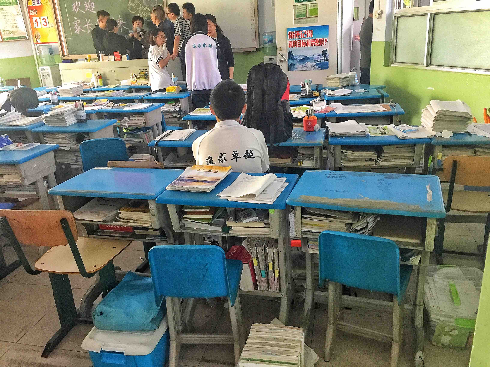

*图：高一的教室，可以看到三个，乃至四个人同桌情况*

不敢想象啊。我们的教室，坐下40个人就已经很拥挤。70个人真的是难以令人想象。每个人的座位下，都有一个箱子，盛着或许是书，或许是卷子。

这就是中国最厉害的高中的教室。

- - -
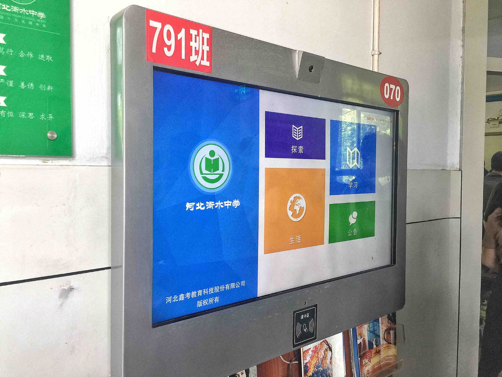

*图：每个班门口都配有的电子触摸屏幕*

即使教室比较破旧，可是电教什么的却不差什么。像这样的屏幕，每个班都有一块。在楼道里还有自动售货机，真是不知道比我们高到哪里去了。

在教学楼里，人来人往，学生拿着自己的东西，家长和学生一起。我去的仅仅是高一的教室。这里的高一，感觉比我校的高三还要累上许多。

看看我拥有的条件，很惭愧，但我也无能为力。我妄想着以笔为刃，然而我确实也只是一个普通的高中生。我比他们所拥有的一切好的多，不是靠我，而是靠我的父母。这不应是他们可悲之处，是国家之可悲啊。

### 0x04

从教室里面走出来，家长会已近结束，上午还在学校的学生们也要回家度过两天半（或者一天半？）的五一假期了。

开放日结束，我也只好走出校门。突然就看到右手边，有一个学生，坐在那种拉货的三轮车上，整个三轮车的其他位置全都被行李占满。这一切突然撞入眼帘，不经意间也撞入心坎。

商量好去哪里吃中午饭，一家人就开着车前往目的地。天气很热，车的座椅经过半个上午的炙烤都有点发烫。进车关门，空调的声音一时喧闹起来。我坐在后排，百无聊赖的看着窗外有些枯黄的天空。

街上满都是刚放学的衡中的学生，以及骑着各种电动车接他们回去的家长们。车内的温度渐渐降下来了。看着窗外，想着上午所见的一切，刚要有些感慨，突然就看到那个坐在电动车上的女生再次出现在了我的视野里。我坐在凉爽的私家车的车座座上，而她却只能坐在三轮车那或许滚烫的金属板子上。我可以去餐馆吹着空调舒舒服服的吃上一顿然后写一篇游记，她或许只能吃完简朴的饭食接着去写作业。

当这些差距真真的摆在面前——用语文的话说“形成鲜明对比”，或许才是真正能体会到百味辛酸的时候。

- - -

感慨万千。我看着那位同学背后的四个字 **“追求卓越”** ，一时凝神，不知道该说些什么好。

诚然，以衡水中学为代表的一系列超级中学的跑操、近乎军训的日常时间表，还有严苛的各种纪律，的确是一种对于人的特性的磨灭。

但请你放下身位，真的放下你所拥有的一切去思考：

> 你是一个四线城市的普通人家的孩子。你的爸妈并不具有很高的文化素养，家庭的物质条件也不算富裕。你渴望更大的世界，渴望走出小小的县城。你能怎么做呢？

**衡水中学不可能像X大附中一样。** 整个衡水市，给总共十几所的小学，中学，专科学校的教育资金只有6个亿。而光X大附中一所学校，每年从X大能拿到的资金就有3个多亿。怎么比？X大附中的学生，绝大多数的父母都是高级知识分子，家境怎么着也能算得上殷实。怎么比？

衡中所能做的，是给那些想走出去的学生，一个**公平的舞台**，一个**完整的机会**。一个普通的学生，如果他本身有强烈的愿望想要学习，想要提升自己，想要到达更高的平台；那么除了衡中，在一个小小的地级市，还有什么学校能提供给他想要的平台和机遇？既然如此，那外人所诋毁的衡中的一切，对于他，又算得了什么呢？

其实衡水中学更像是一个**中国教育的矛盾的集中体**。人人都知道素质教育好，人人都在媒体上抨击应试教育。可是就算以素质教育闻名的X大附中，一位老师也这么说：“这节课我教你的不是素质教育。我们该应试的时候就得应试。”只要你还处在平民的层次，应试仍然是阶级可能的上升途径中不能避开的一件事。国情在此，如果连衡水中学这样，能给贫苦孩子提供上升机会的平台都要去推翻，那这些人的嘴脸简直是卑鄙。

虽然衡水中学这样的模式的确是一种当前国情下的最优解，但是不能否认，衡水中学还是需要去批判的。诸如衡水中学、毛坦厂中学的出现，根本还是因为**教育资源的极为不均**，这终究不是我们想看到的，我们这一代人也需要去拼搏奋斗的去改变。

- - -

还有最后一点。那位同学，我衷心的祝你好运。愿你能够考上心仪的大学，过上满意的生活。愿阶级不再能成为你的枷锁，你的人生能摆脱这层近乎无解的桎梏。

愿你安好。

*来源：[Dear Earth](https://www.pixiv.net/member_illust.php?mode=medium&illust_id=58898030)*

## 写在最后

如果我有机会，其实我愿意在这所学校里生活上一个月，体验一下北京以外的生活。老是呆在北京，恐怕总会把人生看的过于简单。在那里，恐怕才是中国意义上比较普遍的人生的样子。

但恐怕并我不会去衡中，有机会能去的时候也并不想去如此去为自己拼搏了。

*写于2018年4月30日。*